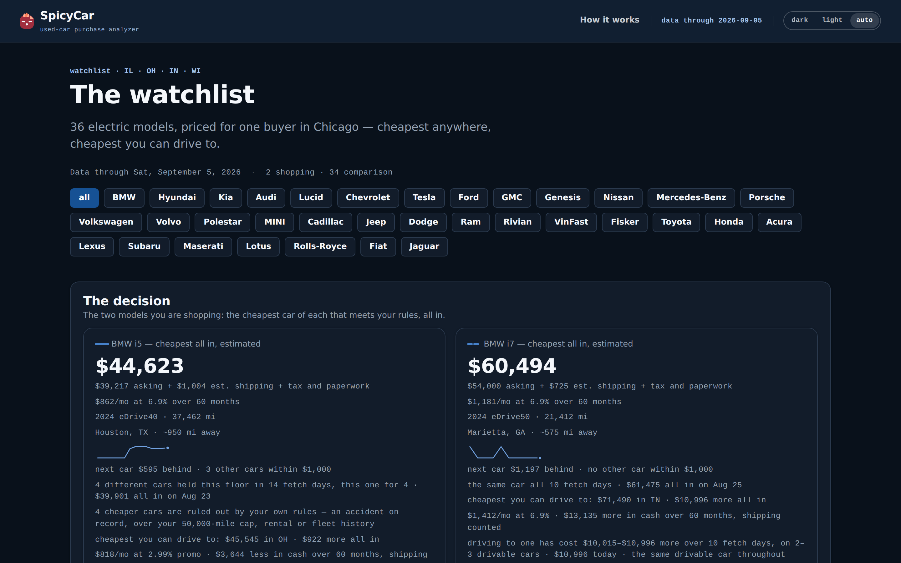
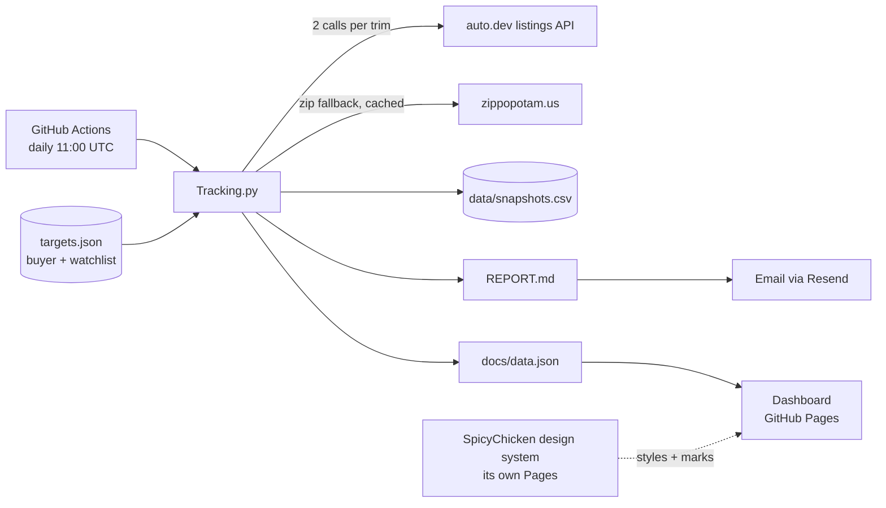

<p align="center">
  <a href="https://spicychicken59.github.io/SpicyCar/"></a>
</p>

# SpicyCar

[](https://github.com/spicyChicken59/SpicyCar/actions/workflows/daily.yml)

**A used-car purchase analyzer.** Every day it snapshots every BMW i4 and i5 on the market, prices
each one as what it would actually cost to land in a specific buyer's driveway, and publishes the
result as a report, an email, and a dashboard.

It runs on the free tier of one API, GitHub Actions, and GitHub Pages. No servers, no database — a
CSV in the repository is the ledger.

**[Dashboard](https://spicychicken59.github.io/SpicyCar/) ·
[How it works](https://spicychicken59.github.io/SpicyCar/how.html) ·
[Today's report](REPORT.md)**

## The idea

Asking price alone does not tell you what a car costs. A $38,000 car in San Diego and a $45,000 car
in Indianapolis are not $7,000 apart for a buyer in Chicago if one has to ride a truck for 1,800
miles. SpicyCar shows both numbers, every day, on every car:

```
asking            exactly as listed — every sort, tile and chart uses it
+ shipping        0 in-state · else max($350, miles_from_home × $0.65), stated on the car
```

The sum is never less than asking. Miles are shown next to every price, not priced in. Which cars
are sitting, which are being cut, which just disappeared — the cheapest anywhere and the cheapest
close to home, for *this* buyer.

Two things are configured, separately:

- **buyer** — who is purchasing: home zip, the states they will drive to for a car, and how they
  value miles and shipping. One buyer today; the first real use is a buyer near Chicago shopping
  for an i5 eDrive40. The shape is built for more.
- **watchlist** — what to track: brands → models → trims. Every trim of the BMW i4 and i5, plus
  comparison models from Hyundai, Kia, Audi, Lucid and Chevrolet on a slower cadence, so the one
  they want can be judged against its siblings and its rivals. `buyer.shopping` names the targets
  that lead the report in full; everything else gets one line.

## Design decisions

**It runs on about 30 API calls a day.** The free plan allows 1,000 calls a month at 20 listings
each. So each target is fetched twice — once filtered to the buyer's states (the API takes a comma
list, so three states cost one call) and once nationally — and each target has a *depth* (the one
being shopped gets every sort and page, the rest get the cheapest 20) and a *cadence*: comparison
brands run every other day, spread evenly across the cycle in watchlist order, so six brands fit the
plan. A hard `budget_per_day` makes the script refuse to run if any day in the next two weeks would
exceed it, and it prints the plan before it starts.

**It is honest about what it cannot see.** Because each query returns only the cheapest N, a car
can vanish from the data by being priced *above* the day's cut-off rather than by selling. Those are
labelled "priced above today's cut-off" on the dashboard and left out of the report's "gone" list.

**Scope by state, not by radius.** The first version placed listings into city radii by their
coordinates and returned one or two local cars a day while the same cars appeared nationally with
Midwest addresses. The cause: for listings it cannot geocode, the API returns exactly `(0, 0)` —
null island, 5,900 miles from Indianapolis — which passes every null check and fails every radius.
Now a listing is in-state when its own `state` field says so; coordinates only price shipping, with
a cached zip-code fallback. *Use the field that means the thing.*

**Buyer and watchlist are separate.** Cost model and geography belong to a person; brands and trims
belong to the market. Keeping them apart is what makes the second buyer an addition, not a rewrite.

**Nothing to operate.** A scheduled Action, a CSV rewritten in place each run (so a same-day re-run
replaces rather than duplicates), a static dashboard that reads one JSON file, and a design system
loaded live from its own repo's Pages so the app restyles itself when the system updates.

## Architecture



**Stack:** Python 3.12 + `requests` · GitHub Actions · GitHub Pages · vanilla JavaScript, no build
step · [SpicyChicken design system](https://github.com/spicyChicken59/design-system).

## What you get each day

- `REPORT.md` — grouped by model then trim: price changes, vehicles gone since the last snapshot,
  every in-state listing grouped by state, and the five best-value cars out of state.
- The dashboard — opens on every model at once: a photo per model, lowest asking nationwide and
  in-state, median, a trend line, and one chart with every model's lowest asking price over time.
  Then brand and model tabs; on every model, the two lowest-asking cars with photos under the
  current filters; trim, state, year and mileage filters; lowest and median asking price over time; one row per vehicle with photo, history flags (CPO, owners, accidents,
  ex-lease), distance from home, shipping estimate, days on market and a price sparkline; and the
  "gone" list.
- `data/snapshots.csv` — every listing seen, every day, with coordinates and distance from home.

## Run it yourself

1. Fork. Add repository secrets: `AUTODEV_API_KEY` (required), `BUYER_HOME_ZIP` (the buyer's zip —
   it stays out of the repo and out of every output), and `RESEND_API_KEY` + `EMAIL_TO` if you want
   the email.
2. Settings → Pages → *Deploy from a branch* → `main` → `/docs`.
3. Edit `targets.json`: your `buyer`, your `watchlist`. The Action runs at 11:00 UTC and can be
   started by hand from the Actions tab.

Locally: `AUTODEV_API_KEY=… python Tracking.py`. To preview the dashboard, serve the folder
(`python -m http.server` inside `docs/`) — it fetches `data.json`, which browsers block on `file://`.

## Configuration

### buyer

| Key | Meaning |
|---|---|
| `home_zip` | Where the car ends up; distances are measured from here. Leave it `null` and set the `BUYER_HOME_ZIP` repository secret instead — the tracker reads it from the environment, never caches it, and never writes it to any output. |
| `states` | Two-letter codes. Listings in these states are drivable: no shipping. |
| `ship_per_mile`, `ship_min` | Shipping estimate for everything else: `max(ship_min, distance × ship_per_mile)`. Set `ship_per_mile` to `null` for a flat rate. |
| `ship_cost` | Flat shipping, used when distance is unknown or `ship_per_mile` is off. |
| `cents_per_mile`, `mileage_baseline` | Optional mileage adjustment, **off by default (`0`)**. Turning it on prices miles into the "asking + shipping" figure, which can then fall below asking — miles are shown instead. |
| `shopping` | Target ids being shopped (e.g. `bmw-i5-edrive40`). They lead the report in full and the dashboard opens on the first; every other model is a one-line comparison. |

### watchlist

| Key | Meaning |
|---|---|
| `budget_per_month`, `budget_per_day` | The API plan (checked on the average over the next two weeks) and a cap on any single day; the script refuses to run if either would be exceeded. |
| `defaults` | Fallbacks for the per-target parameters below. |
| `legacy_ids` | Old target ids → new ids, so history carries over when the config is restructured. |
| `watchlist.<brand>` | `label`, `make` (as the API spells it), `active`, parameter overrides, and `models`. |
| `…models.<model>` | `label`, `model` (API spelling — a comma list is OR, handy for case variants), `years`, `note`, `active`, parameter overrides, and optional `trims`. A model without `trims` is one target across all its trims. |
| `…trims.<trim>` | `label`, `trim_query` (sent as `vehicle.trim`, comma list is OR), `trim_match` (client-side check against the trim fields), `trim_exclude` (drop if this appears — "grand" keeps Grand Touring out of Touring), `note`, `active`, parameter overrides. |

Parameters resolve trim ← model ← brand ← defaults:

| Parameter | Meaning |
|---|---|
| `min_price` | listings below this are ignored — monthly payments or typos, not cars |
| `depth` | `light` (1 call per source) or `full` (`sorts` × `pages` calls per source) |
| `cadence` | fetch every N days (default 1). Targets are spread across the cycle; on off days the report and dashboard show the last fetch, marked "as of" |
| `sorts`, `pages` | what `full` depth fetches (defaults: `price.asc` + `miles.asc`, 2 pages) |
| `years` | model years; sent as a range and also filtered client-side |

A target's id is `brand-model-trim`, or `brand-model` for a model without trims. Add a brand as
another key under `watchlist`; the dashboard grows a brand tab. Check the printed call plan after
any change — it shows today, the worst day in the next two weeks, and the monthly average.

## Roadmap

- Drill below state: county or metro.
- Distance-based "drivable" instead of state lines.
- A second buyer profile — the config is already shaped for it.
- More brands on the watchlist.

## Author

Mohammed Tahir Madni — [github.com/spicyChicken59](https://github.com/spicyChicken59)
