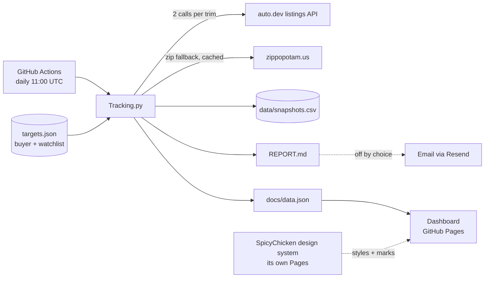

<!-- The hero is a real capture of the dashboard, taken against data_through 2026-08-31, and
     it DATES: the numbers in it are the numbers of that morning and the live dashboard has
     moved on. That is the deal a screenshot makes; the alt below is deliberately structural
     (a chip row, a tile row, what changed) and names no figure, so it stays true after the
     picture does not. Retake it whenever the page changes shape — never by hand:
       node tools/shoot_hero.mjs <design-system-checkout>
     which is also what re-renders docs/og.png. That card is data-free precisely because
     nothing in the daily run regenerates a PNG; see the header of tools/shoot_hero.mjs. -->
<p align="center">
  <a href="https://spicychicken59.github.io/SpicyCar/"></a>
</p>

# SpicyCar

[](https://github.com/spicyChicken59/SpicyCar/actions/workflows/daily.yml)

**A used-car purchase analyzer.** Every day it snapshots the BMW i5 and i7 being shopped —
including a nationwide watch on every certified (CPO) i5 under 30,000 miles, where the
promo rate on certified EVs (2.99% on the i5) makes the financing the story — their siblings
and rivals follow on their own cadence. Each car is priced as what it would actually cost to land in a
specific buyer's driveway, and the result is published as a dashboard, with a committed Markdown
report beside it as the day's record. (An email path exists and is switched off: see below.)

It runs on the free tier of one API, GitHub Actions, and GitHub Pages. No servers, no database — a
CSV in the repository is the ledger.

**[Dashboard](https://spicychicken59.github.io/SpicyCar/) ·
[How it works](https://spicychicken59.github.io/SpicyCar/how.html) ·
[Today's report](REPORT.md)**

## The idea

Asking price alone does not tell you what a car costs. A $38,000 car in San Diego and a $45,000 car
in Indianapolis are not $7,000 apart for a buyer in Chicago if one has to ride a truck for 1,800
miles. SpicyCar shows both numbers, every day, on every car:

```
asking            exactly as listed — every sort, tile and chart uses it
+ shipping        0 if drivable · else max($350, banded(anchor miles × 1.18)), stated on the car
                  $1.20/mi to 500 road miles, $0.70 to 1,000, $0.45 to 1,500, $0.30 beyond —
                  marginal, like tax brackets. An ESTIMATE until real quotes calibrate it.
```

The sum is never less than asking. Miles are shown next to every price, not priced in. Which cars
are sitting, which are being cut, which just disappeared — the cheapest anywhere and the cheapest
close to home, for *this* buyer.

A car is **drivable** — no shipping — when it sits in one of the buyer's states, and only then:
the buyer names the states, and the line sits exactly where they drew it. (A drive-hours radius
was tried and removed on purpose — straight-line miles make road claims they cannot keep.)
**Spicy picks** come in two lists computed under one rule: the best values in the buyer's states,
and the best values worth shipping from anywhere else.

Two things are configured, separately:

- **buyer** — who is purchasing: a public home anchor, the states they will drive to for a car,
  and how they value miles and shipping. One buyer today; the first real use is a buyer near
  Chicago deciding between the i5 and the i7 — drawn by a CPO financing promo (2.99% APR on
  certified EVs). The shape is built for more.
- **watchlist** — what to track: brands → models → trims. The shopped i5 carries a
  nationwide CPO watch (every certified eDrive/xDrive under 30,000 miles — the M trims are
  not the shopping pool — fetched lowest-mileage first, national query only) beside its
  ordinary trim targets. The i7's was stood down before it ever ran: the same recipe on the
  i7 sorts miles.asc into a national pool whose 40 lowest-mileage cars are all uncertified
  2026 delivery-mileage inventory, so no certified car falls inside the window (see the note
  on that trim in `targets.json`). The iX is tracked for comparison only; comparison models from Hyundai,
  Kia, Audi and Lucid run every third day. `buyer.shopping` names the targets that lead the
  report in full; everything else gets one line.

  The list is meant to move with the decision. When it narrowed to the i5 against the i7, the
  i4 stood down — at full depth on a daily cadence it was ten calls a day, a third of the whole
  plan, to benchmark a drivetrain the two shopped pages now show directly — and the iX kept its
  ordinary trims on the slow cadence but gave up its nationwide certified sweep, which is the
  most expensive thing a model can carry and only earns its place on a car you are buying.
  Both are one `active` flag from coming back.

## Design decisions

**It runs on about 30 API calls a day.** The free plan allows 1,000 calls a month at 20 listings
each. So each target is fetched twice — once filtered to the buyer's states plus `search_states`
(the API takes a comma list, so eight states cost one call) and once nationally — and each target
has a *depth* (the two being shopped get both sorts at two pages **plus a newest-first page**, so a
fresh listing is seen the day it appears instead of whenever it ranks among the cheapest; the rest
get the cheapest 20) and a *cadence*: BMW siblings run every other day, rival brands every third
day, spread evenly across the cycle in watchlist order. A hard `budget_per_day` makes the script
refuse to run if any day in the next two weeks would exceed it, and it prints the plan before it
starts.

**It is honest about what it cannot see.** Because each query returns only the cheapest N, a car
can vanish from the data by being priced *above* the day's cut-off rather than by selling. Those are
labelled "priced above today's cut-off" on the dashboard and left out of the report's "gone" list.

**Scope by state, not coordinates.** The first version placed listings into city radii by their
coordinates and returned one or two local cars a day while the same cars appeared nationally with
Midwest addresses. The cause: for listings it cannot geocode, the API returns exactly `(0, 0)` —
null island, 5,900 miles from Indianapolis — which passes every null check and fails every radius.
Now a listing is drivable when its own `state` field is one of the buyer's states — no coordinates
involved at all, so a car that cannot be placed on the map still lands in the right bucket.
Coordinates are for pricing shipping, nothing else. *Use the field that means the thing.*

**Distances measure from a public anchor, not the home.** Every listing's distance appears in
public outputs, and a distance is an exact constraint: hundreds of dealer coordinates plus a
distance each overdetermine the origin, so distances measured from a private home zip can be
trilaterated back to the house no matter how they are rounded (the shipping dollars leak the same
signal at `ship ÷ rate`). So `buyer.anchor` is a public point — downtown Chicago, whose name the
config publishes anyway — and every distance and shipping estimate measures from
it. Nothing private feeds any output. The old `BUYER_HOME_ZIP` secret still works as a fallback
for anyone who accepts that trade. Distances are also rounded to 25 miles: they are estimates for
judging a drive, not measurements.

**Buyer and watchlist are separate.** Cost model and geography belong to a person; brands and trims
belong to the market. Keeping them apart is what makes the second buyer an addition, not a rewrite.

**Nothing to operate.** A scheduled Action (with a concurrency guard, and a rebase-and-retry push
so a busy `main` can never cost a day's snapshot), a CSV rewritten in place each run (so a same-day
re-run replaces rather than duplicates), a static dashboard that reads one JSON file, and the
SpicyChicken design system pinned at v2.4.0 via jsDelivr.

## Architecture



**Stack:** Python 3.12 + `requests` · GitHub Actions · GitHub Pages · vanilla JavaScript, no build
step · [SpicyChicken design system](https://github.com/spicyChicken59/design-system).

## What you get each day

- `REPORT.md` — grouped by model then trim: price changes, vehicles gone since the last snapshot,
  every drivable listing grouped by state, and the five best-value
  cars beyond the buyer's states.
- The dashboard — "the watchlist" opens on **the decision**: one tile per model named in
  `buyer.shopping`, each holding the cheapest car of its watched trims all in — asking plus
  shipping plus tax and paperwork, because a California car and an Ohio car are not comparable on
  the sticker — with the payment at that car's own rate, the cheapest one you could drive to
  instead, how far it sits from typical for its own trim and year (in both directions), a count of
  the cheaper cars your own rules excluded and why, and one line stating the gap between the two
  models in dollars and per month. Then the tiles: **lowest drivable
  asking**, lowest nationwide, the market count and what moved since the last snapshot, and — while
  a promotional finance rate is live — what that rate is **worth** on the cheapest car that can
  actually have it. Below
  that: **your shortlist**, a table of the cars you starred yourself, side by side (four states per
  star — none, shortlisted, called, ruled out — kept in the browser, because a config edit needs a
  commit and a decision does not); spicy picks, brand-coloured trend lines, a **model index** table, a **market map** — on the front page
  and every model page: each car at its own coordinates, filled when drivable, hollow when it pays
  shipping, spicy picks ringed and shortlisted
  cars drawn in the accent, photos on hover (on a phone, tap previews and a second tap opens),
  and a view that zooms to whatever the Where filter selects (plus pinch or Ctrl-scroll zoom and
  drag pan) — and one
  **market-over-time chart** —
  colour is the brand, the dash is the model, the shopped models are drawn heavier, an
  interactive legend hides, shows and highlights any line, and 30d / 90d / All chips set a
  remembered time window with the price scale fitted to it. A **budget** — all in, or a month —
  narrows every one of them and is remembered between visits; when it empties one of the models you
  are shopping, the decision panel says which setting did it. Three **multi-select filters** work the
  same way — press any mix, none pressed means all of them: **Where** (each state plus "beyond",
  remembered between visits), **Models** on the watchlist, and **Trim** on a model page. Press two
  and the page becomes a **comparison**: a side-by-side card with a column each, one chart line per
  thing picked instead of one merged line, and — comparing models — every car pooled into one
  ranking with the model named on each row. The comparison is in the address bar
  (`?models=bmw-i5,bmw-ix`), so it is a link you can send. **Spicy picks** come in two lists — the
  best values in the buyer's states and the
  best worth shipping — ranked by value but shown at asking price. Rows click through to each
  model; on every model, its own picks, a hand-written *know the model* card, a **price-vs-miles
  scatter** (picks ringed, a dashed typical-value line per model year, dots coloured by trim),
  trim/year/mileage
  filters plus hide-accidents, hide-rentals and hide-delivery-mileage-stock (under 100 miles is dealer stock, a market of its own — the market tile names the split); sort by asking, asking + shipping, or best value
  vs typical; one row per vehicle with photo, history flags, distance, shipping, days on market
  and a price sparkline — the top thirty shown, one press for all; and the "gone" list, twelve
  most recent first.
- `data/snapshots.csv` — every listing seen, every day, with coordinates and distance from home. The `via` column records which queries returned each row (`National:miles.asc|States:price.asc`), because a target fetching two sorts has two windows and without it a car pushed out of one cannot be told from a car that left the market. Blank on every row written before the column existed — that provenance is genuinely unrecoverable, which is why exit prices are currently withheld for multi-sort targets.

## Run it yourself

1. Fork. Add repository secrets: `AUTODEV_API_KEY` (required), and `RESEND_API_KEY` + `EMAIL_TO`
   if you want the email (the email also warns you when a run fails). Set `buyer.anchor` in
   `targets.json` to your city's coordinates — distances measure from there.
2. Settings → Pages → *Deploy from a branch* → `main` → `/docs`.
3. Edit `targets.json`: your `buyer`, your `watchlist`. The Action runs at 11:00 UTC and can be
   started by hand from the Actions tab.

Locally: `AUTODEV_API_KEY=… python Tracking.py`. To preview the dashboard, serve the folder
(`python -m http.server` inside `docs/`) — it fetches `data.json`, which browsers block on `file://`.

Three checks run on every push, and all three run locally:

```
python -m unittest discover -s tests -t .                     # the tracker, and what the dashboard may assume of its data
node tools/consumer_lint_ci.mjs <design-system> docs/*.html    # the pages against the exact sc.css they pin
node tools/dashboard_smoke.mjs <design-system>                 # the dashboard, opened in a real browser and asked if it works
```

The last one needs `playwright` and its Chromium (`npm i --no-save playwright && npx playwright install
chromium`); without them it says so and passes, since a machine with no browser is not a broken
dashboard. It reaches nothing off the machine — the design-system checkout answers every CDN request.

## Configuration

### buyer

| Key | Meaning |
|---|---|
| `anchor` | `[lat, lon]` of a **public** point distances measure from — your city centre, not your house. Committed on purpose: published distances from a private point can be trilaterated back to it. Legacy: leave it out and set the `BUYER_HOME_ZIP` secret instead, accepting that exposure. |
| `states` | Two-letter codes. Listings in these states are drivable: no shipping. |
| `search_states` | Extra states included in the state-filtered API query — nearby markets worth watching from beyond (for Chicago: MI, IA, MO, KY). A comma list is one call, so they cost nothing. |
| `ship_bands`, `ship_road_factor` | Shipping estimate for everything else. Straight-line distance is first inflated to a road distance by `ship_road_factor` (1.18 — roads are not great circles), then priced through `ship_bands` **marginally, like tax brackets**: each band's `per_mile` applies only to the miles inside it, and the open band (`"to": null`) carries the rest. Marginal is a correctness requirement, not a preference — a band that *replaced* the rate instead of stacking made the estimate non-monotone, charging $574 at 423 miles and $425 at 424. |
| `ship_min` | Floor under the banded estimate. No hauler quotes below this whatever the distance. |
| `ship_per_mile` | Legacy flat rate, used only when `ship_bands` is empty: `max(ship_min, straight_line_distance × ship_per_mile)`. Note it does **not** apply `ship_road_factor` — a bands-less config behaves exactly as it did before bands existed, byte for byte, and that is deliberate. Leave the bands set and this is never read. |
| `ship_cost` | Flat shipping, used when distance is unknown or neither bands nor `ship_per_mile` are set. |
| `ship_quotes`, `ship_calibrated` | Real hauler quotes (`{"miles": …, "price": …, "route": …}` — the key is `price`, and `miles` is the miles the BROKER quoted, not the great-circle figure) the run scores the bands against, and the date a human last did that. A quote missing either number is announced on the run log and skipped rather than silently ignored, and the run exports what it found — `{n, mean_error, worst, calibrated}` under `buyer.ship_calibration`, or `null` while no quotes exist. **Every shipping number on the page is an estimate until this is populated** — nothing fetches a quote, so the bands are a guess with a shape, not a price. |
| `cents_per_mile`, `mileage_baseline` | Optional mileage adjustment, **off by default (`0`)**. Turning it on prices miles into the "asking + shipping" figure, which can then fall below asking — miles are shown instead. |
| `shopping` | Target ids being shopped (e.g. `bmw-i5-edrive40`). They lead the report in full; every other model is a one-line comparison. |
| `shortlist` | The specific cars being decided on, by VIN: `["WBY33FK09RCR29277", {"vin": "…", "note": "called dealer 8/25"}]`. They open the report and pin to the dashboard's front page with price, movement and your note — and say loudly when one is cut, or gone. |
| `picks` | How the spicy picks are chosen: `count` (per list), `per_model` (cap on the front page), `max_miles`, `cents_per_mile` + `mileage_baseline` (the allowance used only to rank), `exclude_accidents`, `exclude_rental`. Picks are scored against the typical value of their own model — never a separate drivable-only median — then split into two lists: drivable, and worth the ship. Only cars genuinely under typical qualify. Shown at asking price. |

### watchlist

| Key | Meaning |
|---|---|
| `budget_per_month`, `budget_per_day` | The API plan (checked on the average over the next two weeks) and a cap on any single day; the script refuses to run if either would be exceeded. |
| `defaults` | Fallbacks for the per-target parameters below. |
| `legacy_ids` | Old target ids → new ids, so history carries over when the config is restructured. |
| `watchlist.<brand>` | `label`, `make` (as the API spells it), `active`, parameter overrides, and `models`. |
| `…models.<model>` | `label`, `model` (API spelling — a comma list is OR, handy for case variants), `years`, `note`, `notes` (hand-written `good` / `bad` / `watch` lists shown on the model page), `active`, parameter overrides, and optional `trims`. A model without `trims` is one target across all its trims. |
| `…trims.<trim>` | `label`, `trim_query` (sent as `vehicle.trim`, comma list is OR), `trim_match` (client-side check against the trim fields), `trim_exclude` (drop if this appears — "grand" keeps Grand Touring out of Touring), `note`, `active`, parameter overrides. |

Parameters resolve trim ← model ← brand ← defaults:

| Parameter | Meaning |
|---|---|
| `min_price` | listings below this are ignored — monthly payments or typos, not cars |
| `depth` | `light` (1 call per source) or `full` (`sorts` × `pages` calls per source) |
| `cadence` | fetch every N days (default 1). Targets are spread across the cycle; on off days the report and dashboard show the last fetch, marked with its own day — "as of" in the report, "data through" on the dashboard |
| `sorts`, `pages` | what `full` depth fetches (defaults: `price.asc` + `miles.asc`, 2 pages) |
| `newest` | extra newest-first (`createdAt.desc`) pages per source, so brand-new listings are caught the day they list. On for the shopped targets; new cars lead their report section as **New today**. Skipped automatically when a query already returned its whole scope. |
| `years` | model years; sent as a range and also filtered client-side |

A target's id is `brand-model-trim`, or `brand-model` for a model without trims. Add a brand as
another key under `watchlist`; the dashboard grows a brand tab. Check the printed call plan after
any change — it shows today, the worst day in the next two weeks, and the monthly average.

## Roadmap

- ~~Compare two cars at once, not one at a time.~~ Shipped: press two model or two trim chips
  and the page becomes a comparison — a side-by-side card, a line each, and one pooled table.
- ~~Distance-based "drivable" instead of state lines.~~ Tried, then removed on purpose: states are the buyer's own answer to "will I go get it?", and a straight-line radius makes road claims it cannot keep.
- A second buyer profile — the config is already shaped for it.
- Drill below state: county or metro.

## Author

Mohammed Tahir Madni — [github.com/spicyChicken59](https://github.com/spicyChicken59)
