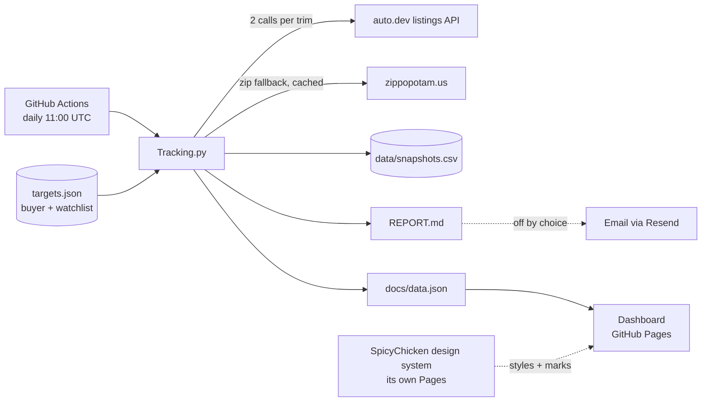

<!-- The hero is a real capture of the dashboard, taken against data_through 2026-09-05, and
     it DATES: the numbers in it are the numbers of that morning and the live dashboard has
     moved on. That is the deal a screenshot makes; the alt below is deliberately structural
     (a chip row, a tile row, what changed) and names no figure, so it stays true after the
     picture does not. Retake it whenever the page changes shape — never by hand:
       node tools/shoot_hero.mjs <design-system-checkout>
     which is also what re-renders docs/og.png. That card is data-free precisely because
     nothing in the daily run regenerates a PNG; see the header of tools/shoot_hero.mjs. -->
<p align="center">
  <a href="https://spicychicken59.github.io/SpicyCar/"></a>
</p>

# SpicyCar

[](https://github.com/spicyChicken59/SpicyCar/actions/workflows/daily.yml)

**A used-car purchase analyzer.** It tracks 21 models with a guaranteed model turn every 3 days,
rotating individual trims, and searches for both low prices and newly listed cars. Choose what you
are shopping in the dashboard; every model keeps its share of the collection budget. The BMW i5,
i7 and iX sit alongside one battery EV from each of the other 17 brands in this watchlist.
Each listing shows asking price, estimated shipping and purchase costs, with price history behind
it. The dashboard and committed Markdown report publish the same underlying observations.
An email path exists and is switched off: see below.

It runs on the free tier of one API, GitHub Actions, and GitHub Pages. No servers, no database — a
CSV in the repository is the ledger.

**[Dashboard](https://spicychicken59.github.io/SpicyCar/) ·
[How it works](https://spicychicken59.github.io/SpicyCar/how.html) ·
[Today's report](REPORT.md)**

## The idea

Asking price alone does not tell you what a car costs. A $38,000 car in San Diego and a $45,000 car
in Indianapolis are not $7,000 apart for a buyer in Chicago if one has to ride a truck for 1,800
miles. SpicyCar shows both numbers, every day, on every car:

```
asking            exactly as listed — every sort, tile and chart uses it
+ shipping        0 if drivable · else max($350, banded(anchor miles × 1.18)), stated on the car
                  $1.20/mi to 500 road miles, $0.70 to 1,000, $0.45 to 1,500, $0.30 beyond —
                  marginal, like tax brackets. An ESTIMATE until real quotes calibrate it.
```

The sum is never less than asking. Miles are shown next to every price, not priced in. Which cars
are sitting, which are being cut, which just disappeared — the cheapest anywhere and the cheapest
close to home, for *this* buyer.

A car is **drivable** — no shipping — when it sits in one of the buyer's states, and only then:
the buyer names the states, and the line sits exactly where they drew it. (A drive-hours radius
was tried and removed on purpose — straight-line miles make road claims they cannot keep.)
**Spicy picks** come in two lists computed under one rule: the best values in the buyer's states,
and the best values worth shipping from anywhere else.

Two things are configured, separately:

- **buyer** — the purchase context: a public home anchor, states worth driving to, shipping
  assumptions, financing estimates and a shopping list. The first buyer is near Chicago.
- **watchlist** — what to track: brands → models → trims. It defines the models and filters.
- **collection** — how the shared API allowance is allocated. Fair collection gives every model
  a baseline turn; volume and observed useful VINs per call rank additional work. Shopping choices
  affect the report and interface, without taking collection turns away from other models.

  ### Changing which car you are shopping

  1. Use the dashboard's car chooser and Select all control. Those preferences stay on your device.
     To change the default report emphasis, edit `buyer.shopping` with valid target IDs.
  2. `AUTODEV_API_KEY=offline python3 tools/rebuild_outputs.py` regenerates the site and report
     without buying data. It also prints the current call plan.
  3. Run the tests. Changing shopping preferences must leave the baseline budget and coverage intact.
     Adding models or changing API query filters warrants checking the printed plan and documentation.

  The old `shopping_fetch`, `comparison_fetch` and `cpo_watch` recipes remain available only with
  `collection.enabled: false`. In fair mode, certified cars arrive through ordinary searches and
  retain their CPO badges; there are no separate paid certified watches. Their old snapshot rows
  remain archived under the original target IDs, without being relabelled as fresh trim sightings.

  **Outside BMW it is one EV per brand, model year 2024 and newer.** The 2024+ rule is one
  line in `defaults` and no target restates it. Every brand selling a 2024-or-newer battery
  EV in the US carries its best-selling nameplate — Tesla the Model Y, Ford the Mach-E,
  Chevrolet the Equinox EV, Rivian the R1S, Cadillac the Lyriq, and so on down to the brands
  whose whole US electric range is one car. Three are chosen rather than ranked, because the
  buyer asked for them: Hyundai's Ioniq 9 (not the better-selling Ioniq 5), Kia's EV9 and
  Audi's A6 e-tron. `buyer.shopping` names the targets that lead the report in full;
  everything else gets one line.

  **Two limits of that rule, written down because neither is visible from the output.**
  First, the listings API has no fuel or powertrain parameter — the query is make plus
  model — so "every EV" has to be enumerated brand by brand, and a battery car sharing a
  nameplate with a combustion one cannot be isolated at all. Where that happens the
  EV-only string is what goes in even when it costs the more popular model: Porsche is
  the Taycan and not the Macan Electric, because `vehicle.model=Macan` returns petrol
  Macans the query cannot exclude. The failure mode of a too-specific string is an empty
  target, which the page says plainly; the failure mode of a too-loose one is petrol cars
  in an EV screener, and *nothing used to catch it*. The query cannot ask, but the
  **response answers**: every listing carries `vehicle.fuel` (with `vehicle.type` and
  `vehicle.engine` agreeing), the record had been reading past it since the first commit,
  and a listing the feed calls petrol, diesel or hybrid is now refused on the way in and
  counted in the run log's drop table. Said and not said are different: a feed that fills
  none of the three is not evidence of petrol, and refusing on silence would empty a whole
  target the day one stopped populating it — a total outage dressed as a quiet market. The
  same trap is live for Dodge (`Charger` is also a petrol six), MINI (`Countryman`),
  Ford (some feeds file the Mach-E under `Mustang`) and Genesis (`GV70`), and it is why
  the Acura ZDX row depends on the year filter: Acura sold a completely different,
  petrol ZDX from 2010 to 2013.

  Second, **"most popular" systematically picks the cheapest nameplate at a premium
  brand**, which is backwards for a buyer shopping an i5 against an i7. Mercedes's
  best-seller is the EQB at around $35,000 used, not the EQE SUV; Volvo's is the EX30,
  not the EX90; Genesis's is the GV60, not the Electrified GV70; Tesla's is the Model Y,
  not the Model S. Five of the rows are therefore market coverage rather than
  cross-shops, and nothing in the config expresses that difference.

  An earlier draft of this paragraph said a completeness row "wins any cheapest-first
  ranking", and that is wrong about the mechanism — worth correcting rather than
  deleting, because the wrong mechanism suggests the wrong fix. Nothing on the front
  page is ranked by price. The picks are ranked by how far under **its own model's**
  typical price a car sits, cohorts never cross models, `picks.per_model` caps each
  model at two, and `picks.reserve_shopping` holds the first two drivable seats for the
  models actually being shopped — a rule `choose_picks_reserving` exists for and whose
  docstring records the exact failure it was written against. On today's sheet the
  drivable picks really are an i5, an i7, an iX and an Ioniq 9.

  What is true, and is the defect, is that **price class is nowhere in the ranking**.
  A $27,025 Kia EV9 at 35% under a typical EV9 outranks a $64,729 i7 at 4% under a
  typical i7, because a margin is a ratio and a ratio does not know what a car costs.
  The drivable list is half-protected by the reserve; the shipped list has no reserve at
  all. With seven models that was a curiosity. With thirty-six it means a buyer looking
  at $50,000-$90,000 cars can open the page to four picks they would never buy. The
  budget filter is the lever that exists; a notion of class is the one that does not,
  and it is on the roadmap rather than quietly patched.

  **Thirty of the thirty-six have never been fetched, and their model strings are
  unverified guesses.** A string that names something the API does not know bills a call
  every cadence and comes back empty — and an empty answer writes no row, so the model
  looks exactly like one whose turn has not come round. Both surfaces tell them apart
  now: a model no query has reached says "not fetched yet" and names its first run, one
  whose query ran and found nothing says "asked <date>, nothing found", and the run log
  names every target that spent a call for zero records. That is the count that says a
  model string is wrong, and it had no name before — `silent_targets` cannot catch it,
  because a call *was* billed.

  The list can change as the search changes. The i4 is active again, covering 2024+ eDrive40
  and M50 cars. The i4 and iX receive the same model turns as
  every other active model, regardless of whether they are on the shopping list.

## Design decisions

**It runs on about 21 API calls a day for guaranteed coverage.** The configured free plan is
1,000 calls a month at 20 listings per call. Each model turn asks for the cheapest national page,
the cheapest page within the search states, and a national newest-first page. A state comma list
costs one call; the newest probe is national only. A national page that exhausts the market lets
the collector skip redundant work.

All 21 models get a turn every 3 days. Individual trims rotate through those turns, so a model
with one, two or three trims refreshes each trim every 3, 6 or 9 days. The baseline range is
21–21 calls per day: 630–651 calls in a 30- or 31-day month, or roughly 640 using the legacy 30.5-day
planning average. The baseline has a worst day of 21 against the hard daily cap of 40; the
plan-check cycle is 18 days here, one complete trim schedule. After the 50-call reserve,
299–320 monthly calls remain for deeper pages, market counts and extra observations. Adding models can slow
the common model turn to keep the full watchlist affordable. Choosing a different shopping car
cannot change another model's guarantee.

**Additional work earns its place.** Dated national model totals provide market size, without
summing overlapping trim counts. Unknown or stale totals use a neutral starting weight. Additional
whole-target observations are ranked using square-root market size and smoothed new or changed
VINs per call, bounded so one large market cannot absorb the budget. Overdue targets go first,
and recent bonus spend reduces repeat preference for the same model. Results returned by a
market-count query are ingested too. A total is an API query estimate before local filtering;
tracked listing counts are samples and are never presented as the whole market.

**Spare calls reach beyond the first page.** At least half of the available extra-call
allowance is reserved for deeper cheapest-first pages before market-count queries and extra
whole-target turns, when eligible results remain. Only a target successfully observed in the
same run can be explored. National and regional page positions rotate separately and persist
between runs, continuing beyond page 50; exhausted results or changed queries reset the position.
Unused exploration capacity returns to the shared allowance, and one- or two-call leftovers
can buy further pages. Future baseline turns and the 50-call recovery reserve remain protected.
Deeper cars retain dated snapshots and history; a later first-page refresh does not carry them
forward as newly seen. Skipping intervening pages cannot prove that an absent car left the market,
and a failed extra query cannot invalidate a successful baseline observation.

**Actual requests control the bill.** Every HTTP attempt, including retries, is charged to an
atomic journal before it is sent. The daily tracker reads both that journal and the spend ledger,
respects the actual calendar month, and keeps 50 monthly calls for recovery. Early-stop savings
can fund additional observations in the same run; remaining windfalls are paced over the month,
after reserving future baseline turns. A same-day dispatch normally rebuilds for free. Explicit
recovery remains subject to the hard caps.

`data/spend.json` retains planned versus actual spend. `data/requests.json` preserves request
charges if the tracker crashes, and `data/collection.json` records query yield and model totals.
The site exports the collection plan with model intervals, market estimates, useful VINs per
call, and seven-day exploration calls, useful cars and deepest page reached. A scheduled target
that never ran is a coverage gap, not a successful saving.

**Why every model asks its own states.** One baseline call goes to asking
the buyer's four states, plus the four watched from beyond them, the question the national query
just asked — and whether that is worth paying for is an empirical question
`data/source_overlap.json` has been answering since the audit that added it. It has now answered it. Over the 28 observations recorded between 2026-09-02 and
2026-09-06 the States query found 310 cars and 232 of them were invisible to the national one,
because the twenty cheapest in the country and the twenty cheapest within driving range are almost
disjoint sets.

The split that governs it is not which brand a model belongs to but **how big a catch its national
query is allowed**. Of what the States query brings back, a `depth: full` target — about a hundred
cars nationally — loses 21% by dropping its States half, which is the redundancy `sources_for()`
describes and it is real there. A `depth: light` target fetches twenty, the whole country, cheapest
first, and loses **88%**. The denominator is the States catch, not the model's whole day: the
national query keeps what it found either way. About 84% of that States-only catch was in the four
drivable states; the rest was in the four watched from beyond them, and is priced with shipping like
anything else.

**That split is measured on the light targets the log could see, and applied to the 28 by depth.**
It has to be: `source_overlap()` compares two sources and skips a target that only has one, so a
`national_only` target can never contribute an observation — not one of the 28 is in the window, and
between them they hold 0 of the record's 4,997 rows. What carries the inference is the mechanism
rather than the sample: the 28 are all `depth: light`, so their national query returns the twenty
cheapest of that model *in America*, which is the same query shape that lost 88% everywhere it could
be measured. The first fetch of each is what will confirm or refute it, and the log will say so
without being asked.

The fair plan keeps both cheapest-page sources and adds national newest-first discovery for
every model. Freshness no longer depends on whether that model is being shopped. The historical
source-overlap window below explains the regional query's value; ongoing observations measure
whether it continues to earn its call. The legacy national-only certified watches are retired in
fair mode, with their original history preserved.

Those figures are a measurement, not a constant. The log they come from is appended to, committed
every day, and pruned to the newest 120 days, so the window they were read off is frozen in
`tests/fixtures/source_overlap_window.json` — with each row's depth as it was **when the row was
fetched**, which is not the depth its target carries today. One test holds every frozen row against
the live log for as long as the live log still reaches back that far, so the evidence cannot be
invented; another recomputes each percentage from the fixture and asserts it inside its own sentence,
because an earlier version searched for the bare digits anywhere in this file and the two figures
could be *swapped* — README stating the exact inverse of the finding — with the whole suite green;
and a third asks the *current* log whether a light target still loses far more than a full one, which
is the finding rather than the number and is the one that should fail if the market changes its
mind.

**It is honest about what it cannot see.** Because each query returns only the cheapest N, a car
can vanish from the data by being priced *above* the day's cut-off rather than by selling. Those are
labelled "beyond that day's fetch cut-off" on the dashboard and left out of the report's "gone"
list. Cheapest N on the axis that query SORTED by: the ordinary targets sort by price, so the
cut-off is a price, and the nationwide certified watches sort by mileage, so theirs is a mileage —
a car can fall out of one of those by being driven further, not by asking more.

**Scope by state, not coordinates.** The first version placed listings into city radii by their
coordinates and returned one or two local cars a day while the same cars appeared nationally with
Midwest addresses. The cause: for listings it cannot geocode, the API returns exactly `(0, 0)` —
null island, 5,900 miles from Indianapolis — which passes every null check and fails every radius.
Now a listing is drivable when its own `state` field is one of the buyer's states — no coordinates
involved at all, so a car that cannot be placed on the map still lands in the right bucket.
Coordinates are for pricing shipping, nothing else. *Use the field that means the thing.*

**Distances measure from a public anchor, not the home.** Every listing's distance appears in
public outputs, and a distance is an exact constraint: hundreds of dealer coordinates plus a
distance each overdetermine the origin, so distances measured from a private home zip can be
trilaterated back to the house no matter how they are rounded (the shipping dollars leak the same
signal at `ship ÷ rate`). So `buyer.anchor` is a public point — downtown Chicago, whose name the
config publishes anyway — and every distance and shipping estimate measures from
it. Nothing private feeds any output. The old `BUYER_HOME_ZIP` secret still works as a fallback
for anyone who accepts that trade. Distances are also rounded to 25 miles: they are estimates for
judging a drive, not measurements.

**Buyer and watchlist are separate.** Cost model and geography belong to a person; brands and trims
belong to the market. Keeping them apart is what makes the second buyer an addition, not a rewrite.

**Nothing to operate.** A scheduled Action (with a concurrency guard, and a rebase-and-retry push
so a busy `main` can never cost a day's snapshot), a CSV rewritten in place each run (so a same-day
re-run replaces rather than duplicates), a static dashboard that reads one JSON file, and the
SpicyChicken design system shipped as one versioned local snapshot.

## Architecture



**Stack:** Python 3.12 + `requests` · GitHub Actions · GitHub Pages · vanilla JavaScript, no build
step · [SpicyChicken design system](https://github.com/spicyChicken59/design-system).

## What you get each day

- `REPORT.md` — grouped by model then trim, each trim section holding what that query returned at
  that query's price (a car two of a model's queries both matched — the certified watch matches
  cars the ordinary trim targets match too — is in both sections, and the model's own line says
  how many): price changes, vehicles gone since the last snapshot,
  every drivable listing grouped by state, and the five lowest-asking
  cars beyond the buyer's states, each with its shipping estimate. It reads the same data the
  dashboard does and is held to the same rule: a figure carries the denominator that makes it
  true, or it is not printed. Where the two surfaces state the same fact they state it in the
  same words. Every sentence that dates a change names the day it is dating — the day that
  model was last fetched, never the day the file was built — so a rebuild, a dispatch or a
  night whose queries all failed cannot publish an older fetch's cuts as today's.
- The dashboard — "the watchlist" opens on **the decision**: one tile per model named in
  `buyer.shopping` (and, when that list is empty, one sentence saying so and how to get a
  decision — the card no longer removes itself without a word from a reader who has not
  chosen yet), each holding the cheapest car of its watched trims all in — asking plus
  shipping plus tax and paperwork, because a California car and an Ohio car are not comparable on
  the sticker — with the payment at that car's own rate, the cheapest one you could drive to
  instead, how far it sits from typical for its own trim and year (in both directions), a count of
  the cheaper cars your own rules excluded and why, the same floor day by day (a sparkline of the
  cheapest rule-fit car on each day the trims were fetched — never carried forward, never under five
  cars — with how many cars held it and since when), and one line stating the gap between the two
  models in dollars and per month, and over the days both were fetched: its range, its first and
  last value, and how much of the change was each side's own floor moving — then what the money buys,
  in the sheet's own columns for those two cars: model year, miles, owners, certification, days listed,
  with no verdict attached, and an owner count of 0 read as "not reported", not as a fact — and the premium as a trade:
  how many of the cheaper model's rule-fit cars the dearer floor's total buys (the newest, the lowest-mileage,
  how many drivable and certified), and what the dearer car would have to ask to cost the same per month. On a return
  visit with newer data, one sentence first: what changed since the data day you last saw — each shopped model's
  floor then and now, cars first seen since, cars asking less than then, and departures worded by what the sheet
  knows (gone, or merely stopped being seen). Then the tiles: **lowest drivable
  asking**, lowest nationwide, the market count and what moved since the last snapshot, and — while
  a promotional finance rate is live — what that rate is **worth** on the cheapest car that can
  actually have it. Below
  that: **your shortlist**, a table of the cars you starred yourself, side by side (four states per
  star — none, shortlisted, called, ruled out — kept in the browser, because a config edit needs a
  commit and a decision does not); spicy picks, trend lines, a **model index** table, a **market map** — on the front page
  and every model page: each car at its own coordinates, filled when drivable, hollow when it pays
  shipping, spicy picks ringed and shortlisted
  cars drawn in the accent, photos on hover (on a phone, tap previews and a second tap opens),
  and a view that zooms to whatever the Where filter selects (plus pinch or Ctrl-scroll zoom and
  drag pan) — and one
  **market-over-time chart** —
  colour and weight are on the models you are comparing and every other line is context grey (five chart colours cannot carry thirty-four brands), the dash is the model within its brand, an
  interactive legend hides, shows and highlights any line, and 30d / 90d / All chips set a
  remembered time window with the price scale fitted to it. A **budget** — all in, or a month —
  narrows every one of them and is remembered between visits; when it empties one of the models you
  are shopping, the decision panel says which setting did it. Three **multi-select filters** work the
  same way — press any mix, none pressed means all of them: **Where** (each state plus "beyond",
  remembered between visits), **Models** on the watchlist, and **Trim** on a model page. Press two
  and the page becomes a **comparison**: a side-by-side card with a column each, one chart line per
  thing picked instead of one merged line, and — comparing models — every car pooled into one
  ranking with the model named on each row. The comparison is in the address bar
  (`?models=bmw-i5,bmw-ix`), so it is a link you can send. **Spicy picks** come in two lists — the
  best values in the buyer's states and the
  best worth shipping — ranked by value but shown at asking price. Rows click through to each
  model; on every model, its own picks, a hand-written *know the model* card, a **price-vs-miles
  scatter** (picks ringed, a dashed typical-value line per model year, dots coloured by trim),
  trim/year/mileage
  filters plus hide-accidents, hide-rentals and hide-delivery-mileage-stock (under 100 miles is dealer stock, a market of its own — the market tile names the split); sort by asking, asking + shipping, or best value
  vs typical; one row per vehicle with photo, history flags, distance, shipping, days on market
  and a price sparkline — the top thirty shown, one press for all; and the "gone" list, twelve
  most recent first. A VIN field (and `?vin=`) opens one car by its full VIN or its last six
  characters — the model page with the car at the top and its row landed on; a tail that fits two
  cars says so and opens nothing, and a VIN nobody has seen goes through the dead-link notice.
  If a filter you left on hides that car's row, the card says so and offers to clear the one that
  did it, rather than claiming a row the list does not hold — and opening the car clears it for
  you, because a link that names a car is a request to see that car.
- `data/snapshots.csv` — every listing seen, every day, with coordinates and distance from home. The `via` column records which queries returned each row (`National:miles.asc|States:price.asc`), because a target fetching two sorts has two windows and without it a car pushed out of one cannot be told from a car that left the market. Blank on every row written before the column existed — that provenance is genuinely unrecoverable, which is why exit prices are currently withheld for multi-sort targets.

## Run it yourself

1. Fork. Add repository secrets: `AUTODEV_API_KEY` (required), and `RESEND_API_KEY` + `EMAIL_TO`
   if you want the email (the email also warns you when a run fails). Set `buyer.anchor` in
   `targets.json` to your city's coordinates — distances measure from there.
2. Settings → Pages → *Deploy from a branch* → `main` → `/docs`.
3. Edit `targets.json`: your `buyer`, your `watchlist`. The Action runs at 11:00 UTC and can be
   started by hand from the Actions tab.

Locally: `AUTODEV_API_KEY=… python Tracking.py`. To preview the dashboard, serve the folder
(`python -m http.server` inside `docs/`) — it fetches `data.json`, which browsers block on `file://`.

Three checks run on every push, and all three run locally:

```
python -m unittest discover -s tests -t .                     # the tracker, what the dashboard may assume of its data, and that
                                                              # REPORT.md and docs/data.json are what this code builds from the CSV
node tools/consumer_lint_ci.mjs <ds> docs/index.html docs/how.html tools/og_card.html
node tools/dashboard_smoke.mjs <design-system>                 # the dashboard, opened in a real browser and asked if it works
```

The linter takes the source of the og:image with the two pages, because it is a design-system
consumer like they are and raw colour must not slip in through a file nobody checks — that is the
list `check.yml` passes, and `docs/*.html` was a shorter one.

The last one needs `playwright` and its Chromium (`npm i --no-save playwright && npx playwright install
chromium`); without them it says so and passes, since a machine with no browser is not a broken
dashboard. It reaches nothing off the machine — the design-system checkout answers every CDN request.
It also asserts its own size: the number of checks it declares is a constant in the file, compared
against the number it recorded, because this suite has three times been assembled green while
quietly covering less. A skipped check still counts — it is a check that named itself and found no
subject — and while that assertion was made only when nothing skipped, the committed sheet produced
one skip on every run and the backstop never fired.

**The sheet has a transfer budget, and the watchlist is going to spend it.** The browser suite fails
the build when `docs/index.html` passes 200 KB gzipped or `docs/data.json` passes 250 KB — the page
fetches the sheet on load, so its size is a fact about how the site feels, not a housekeeping number.
`tools/measure_sheet.py` answers what it will weigh, by BUILDING the file rather than multiplying:
it clones real rows onto every target that has never fetched, at the cap a `depth: light` target
actually reaches, and runs them through `src`'s own writer, because `indent=1` is most of the raw
size and a compact estimate is not the file a browser fetches. Two estimates of the sibling ledger
once disagreed by a factor of two and only building it settled which was right.

What it measures today, on the committed record:

| the sheet | models | cars | gzipped | of budget |
|---|---|---|---|---|
| as committed | 21 | 862 | 165 KB | 66% |
| every target fetching | 20 | 847 | 161 KB | 64% |
| …three fetches deep on each | 20 | 847 | 171 KB | 69% |
| …seven fetches deep on each | 20 | 847 | 186 KB | 75% |

At thirty-six models that last row read **110%** — the build going red on its own record, in about a
quarter. That is what the trim was for, and it is why the number is re-measured on every config
change rather than argued: there is no field to cut instead. Measured by deleting each in turn,
`series` is 13% of the file and `url` 9%, both load-bearing — the series is what the sparkline draws
and what the cut detector reads, and the url is how a reader opens the listing — and everything else
is under 3%. The sheet was never carrying fat; it was carrying too many models.

**Sixteen models are stood down for it**, and the reason sits beside each `active` flag in
`targets.json` rather than in a commit message. Four are priced far outside anything this buyer is
shopping (Rolls-Royce Spectre, Lotus Eletre, Maserati Grecale Folgore, GMC Hummer EV); one is not a
car anyone chooses between (Ram ProMaster EV); two are orphaned or barely present in the US (Fisker,
whose maker is bankrupt, and VinFast); five are the thinnest used markets on the list (Jaguar I-PACE,
out of production; Fiat 500e; Genesis GV60; Jeep Wagoneer S; MINI Countryman Electric); one had its
US launch slip until there is nothing to find (Volvo EX30); and one is another car under a second
badge — the Subaru Solterra is the Toyota bZ4X, same platform, same plant, and the bZ4X is watched.

Two are off for a different reason, and the flags say so: the **Tesla Model Y** and the
**Polestar 3** are not cars this buyer is choosing between. The Model Y in particular is the
highest-volume used EV in the country and would fill its window every time — it is the one entry on
that list whose absence is a preference rather than an argument about supply, and a reader who found
it missing would otherwise reasonably assume the tool had a gap.

**None of the market reasoning is measured.** The record holds no rows for any of them, because a
model that has never fetched has nothing to be counted, so it is a judgement about the US market
written down as one — and every one is a single flag from coming back. The calls it frees are
deliberately not spent: a faster cadence would only reach those depths sooner.

## Configuration

### buyer

| Key | Meaning |
|---|---|
| `anchor` | `[lat, lon]` of a **public** point distances measure from — your city centre, not your house. Committed on purpose: published distances from a private point can be trilaterated back to it. Legacy: leave it out and set the `BUYER_HOME_ZIP` secret instead, accepting that exposure. |
| `states` | Two-letter codes. Listings in these states are drivable: no shipping. |
| `search_states` | Extra states included in the state-filtered API query — nearby markets worth watching from beyond (for Chicago: MI, IA, MO, KY). A comma list is one call, so they cost nothing. |
| `ship_bands`, `ship_road_factor` | Shipping estimate for everything else. Straight-line distance is first inflated to a road distance by `ship_road_factor` (1.18 — roads are not great circles), then priced through `ship_bands` **marginally, like tax brackets**: each band's `per_mile` applies only to the miles inside it, and the open band (`"to": null`) carries the rest. Marginal is a correctness requirement, not a preference — a band that *replaced* the rate instead of stacking made the estimate non-monotone, charging $599 at 423 miles and $350 at 424 on the bands shipped today. |
| `ship_min` | Floor under the banded estimate. No hauler quotes below this whatever the distance. |
| `ship_per_mile` | Legacy flat rate, used only when `ship_bands` is empty: `max(ship_min, straight_line_distance × ship_per_mile)`. Note it does **not** apply `ship_road_factor` — a bands-less config behaves exactly as it did before bands existed, byte for byte, and that is deliberate. Leave the bands set and this is never read. |
| `ship_cost` | Flat shipping, used when distance is unknown or neither bands nor `ship_per_mile` are set. |
| `ship_quotes`, `ship_calibrated` | Real hauler quotes (`{"miles": …, "price": …, "route": …}` — the key is `price`, and `miles` is the miles the BROKER quoted, not the great-circle figure) the run scores the bands against, and the date a human last did that. A quote missing either number is announced on the run log and skipped rather than silently ignored, and the run exports what it found — `{n, mean_error, worst, calibrated}` under `buyer.ship_calibration`, or `null` while no quotes exist. **Every shipping number on the page is an estimate until this is populated** — nothing fetches a quote, so the bands are a guess with a shape, not a price. |
| `cents_per_mile`, `mileage_baseline` | **Read by nothing, and kept only so an old config still loads.** They used to fold a mileage allowance into the "asking + shipping" figure, which reached one surface: the report printed a sum that did not add up while the dashboard, which drops that value on purpose, showed asking + shipping for the same car. Miles are shown next to every price and never priced into one. The allowance that ranks the picks is `picks.cents_per_mile` below. |
| `shopping` | Target IDs that lead the report and establish default shopping choices. They do not change collection priority in fair mode. Empty means nothing is being shopped; all models retain their guaranteed turns. Dashboard choices remain local to the device. |
| `shopping_fetch` | Legacy only, when `collection.enabled` is false: the depth and cadence given to a shopped target. Fair mode uses the same baseline query recipe for every model. |
| `cpo_watch` | Legacy only, when `collection.enabled` is false: a national certified watch per shopped model. Fair mode collects CPO cars through ordinary searches and retains old watch snapshots without continuing these paid queries. |
| `shortlist` | The specific cars being decided on, by VIN: `["WBY33FK09RCR29277", {"vin": "…", "note": "called dealer 8/25"}]`. They open the report and pin to the dashboard's front page with price, movement and your note — and say loudly when one is cut, or gone. |
| `picks` | How the spicy picks are chosen: `count` (per list), `per_model` (cap on the front page), `max_miles`, `cents_per_mile` + `mileage_baseline` (the allowance used only to rank), `exclude_accidents`, `exclude_rental`. Picks are scored against the typical value of their own cohort (trim and model year with six or more eligible cars, else the year, else the model) — never a separate drivable-only median — then split into two lists: drivable, and worth the ship. Only cars genuinely under typical qualify: below the 95% interval of the cohort's median, so a car inside that median's own sampling error is never called under typical, and a cohort of six to eight cars — whose interval is the whole sample — can call no car under at all. The cohort must also be comparable: every car in it wears the scored car's trim, or the page says too few comparable listings to say and prints no percentage anywhere, the best-value order included. Shown at asking price. |

### watchlist

| Key | Meaning |
|---|---|
| `collection.enabled` | Enables fair model turns, national newest discovery and volume/yield-ranked additional work. Set false only to use the legacy role-based recipes. |
| `budget_per_month`, `budget_per_day` | Hard API caps, checked against the request journal before every HTTP attempt, including retries. The fair baseline is sized for a 31-day month and extra work preserves future baseline turns plus 50 recovery calls. |
| `defaults` | Fallbacks for the per-target parameters below. |
| `legacy_ids` | Old target ids → new ids, so history carries over when the config is restructured — and a **null** value for the opposite case: the rows are known about and deliberately left orphaned. A test fails on any target id in `data/snapshots.csv` that no current target claims, that belongs to no model marked inactive, and that this block does not mention, so the choice has to be made rather than forgotten. It was forgotten once: the Lucid Air's two trim targets merging into one trimless `lucid-air`, and `chevrolet-equinox-ev-rs` becoming `chevrolet-equinox-ev`, left both models reading "not fetched yet" on every surface while the CSV held 257 and 63 rows for them. Chevrolet is mapped — 0 of its rows are pre-2024 and its old window was a subset of the new one. Lucid is not: 53 of its 68 live rows are model year 2022 or 2023, which a 2024+ watchlist can never return, so mapping them would publish 53 cars as current inventory that no query on this sheet could produce. |
| `watchlist.<brand>` | `label`, `make` (as the API spells it), `active`, parameter overrides, and `models`. |
| `…models.<model>` | `label`, `model` (API spelling — a comma list is OR, handy for case variants), `years`, `note`, `notes` (hand-written `good` / `bad` / `watch` lists shown on the model page), `active`, parameter overrides, an optional `cpo` block, and optional `trims`. A model without `trims` is one target across all its trims. |
| `…models.<model>.cpo` | Legacy certified-watch narrowing, used only outside fair mode. The reserved `cpo` trim key remains protected so historical IDs cannot collide with ordinary targets. |
| `…trims.<trim>` | `label`, `trim_query` (sent as `vehicle.trim`, comma list is OR), `trim_match` (client-side check against the trim fields), `trim_exclude` (drop if this appears — "grand" keeps Grand Touring out of Touring), `note`, `active`, parameter overrides. |

Parameters resolve trim ← model ← brand ← defaults:

| Parameter | Meaning |
|---|---|
| `min_price` | listings below this are ignored — monthly payments or typos, not cars |
| `depth` | `light` (1 call per source) or `full` (`sorts` × `pages` calls per source) |
| `cadence` | In fair mode this is derived from the common model turn multiplied by the number of active trims. The trim list rotates, so model and trim refresh intervals are different. Historical recipe overrides apply only outside fair mode. |
| `sorts`, `pages` | what `full` depth fetches (defaults: `price.asc` + `miles.asc`, 2 pages) |
| `newest` | extra newest-first (`createdAt.desc`) pages per source, so brand-new listings are caught the day they list. On for the shopped targets; new cars lead their report section as **New today**. Skipped automatically when a query already returned its whole scope. |
| `years` | model years; sent as a range and also filtered client-side |

**Two columns the record keeps and nothing reads yet.** `seats` and `drivetrain` are how a
person goes from every EV on sale to the six worth looking at — "three rows", "all-wheel
drive" — and neither was recoverable from anything else the CSV held: seats appears nowhere,
and drivetrain only inside the trim string, and only for the brands whose trim encodes it (an
i5 eDrive40 against an xDrive40, but a Model Y Long Range against a Model Y Long Range AWD,
and nothing at all on most of the rest). They are recorded before they are read on purpose:
the filters they are for are worth building once the record shows the feed *fills* them, and
this repo has one sample listing to judge that from. The run log prints the coverage every
night — "seats on 312 of 323 (97%)" — and one real night decides whether those filters get
built or the columns come back out. `drivetrain` is folded to AWD / RWD / FWD, because that
is the question a buyer asks and because 4WD and AWD are the same answer to it on a car with
no transfer case; an unrecognised string is dropped rather than passed through, so the column
holds a vocabulary and not whatever a dealer typed.

A target's id is `brand-model-trim`, or `brand-model` for a model without trims. Add a brand as
another key under `watchlist`; the dashboard grows a brand tab. Check the printed call plan after
any change — it shows today, the worst day of the cycle it covers, and the monthly average. The
window is the least common multiple of the cadences, floored at a fortnight. That stopped being
hypothetical when the watchlist widened: cadences of 1, 2, 3, 4 and 10 repeat over 60 days, so a
flat fourteen would see less than a quarter of the cycle and the guard's answer would depend on
the day it ran — CI approving a config that `main()` starts refusing weeks later, on the day the
window finally meets the peak.

## Roadmap

- ~~Compare two cars at once, not one at a time.~~ Shipped: press two model or two trim chips
  and the page becomes a comparison — a side-by-side card, a line each, and one pooled table.
- ~~Distance-based "drivable" instead of state lines.~~ Tried, then removed on purpose: states are the buyer's own answer to "will I go get it?", and a straight-line radius makes road claims it cannot keep.
- A second buyer profile — the config is already shaped for it.
- Drill below state: county or metro.
- **Say which rows are cross-shops and which are market coverage.** One EV per brand puts
  a $27,000 Kia EV9 and a $75,000 Rivian R1S in one pick list ranked by margin, and a
  margin is a ratio that does not know what a car costs. A per-model flag — or a band
  taken from the budget the reader already sets — read by the picks and the best-value
  order, is the fix; the counts, the map and the market chart should keep every row.

## Author

Mohammed Tahir Madni — [github.com/spicyChicken59](https://github.com/spicyChicken59)


## Visual system snapshot

The dashboard and field guide use the same SpicyChicken cover, original chick mark,
metric strip, chart signature, responsive typography and restrained motion. Motion is
progressive enhancement and follows the device's reduced-motion preference.

The watchlist opens with a visible **signal matrix** for the exact daily-decision
candidates: their estimated totals, existing value context, reach, certification,
and accident record. Unknown facts stay neutral. Exact-car photographs accompany
the detailed decision below; the map comes before the longer picks and listings.
The cover's native section links follow the visible filtered state. All scoring,
eligibility, financing, and data remain owned by the existing tracker and helpers.

`docs/market-studio.css` is the product composition over that shared snapshot;
consumer lint checks it alongside the page's inline styles. The shared system's
[Decision brief recipe](https://spicychicken59.github.io/design-system/templates/decision-brief.html)
demonstrates the reusable matrix-first pattern using only existing system classes.
The dashboard smoke suite includes phone/tablet/desktop, light/dark, keyboard,
unknown-data, photo-source, reduced-motion, forced-color and print checks for it.

The **Places & cars** view brings SpicyHome's split map/card layout and editorial
headings to the same vehicle rows and sort order. Price pills group nearby cars;
select a pin to read its listings, or use **Show on map** from a card. Coordinates
are approximate listing locations, often city or ZIP centroids, and unlocated
cars remain in the list. The original keyboard-operable **Market atlas** is a
second view. Both views use existing data; no provider key or tracking call is
added. OpenStreetMap tiles are attributed and optional: map failures leave the
cards and listing tables usable. `tools/discovery_smoke.mjs` covers sorting,
filters, shortlist state, map/card focus, phone popups, and offline fallback.

The authored pages are `docs/index.html` and `docs/how.html`. The daily tracker writes
`docs/data.json` and `REPORT.md`; it does not regenerate the HTML, so the visual design
survives every daily update without touching the tracker or its data.

`docs/design-system/` is an atomic copy of the shared system's CSS, runtime scripts,
and assets. `provenance.json` records its source commit and a SHA-256 digest for each
file. Refresh the whole snapshot together, never one stylesheet or script in isolation.
CI verifies those digests and checks the pages against that exact upstream commit.
Both live pages resolve their visual assets locally. The existing share-card source and image retain their original version.

For local design review, run `npm run dev` (Node only, no dependencies) and open the preview address it serves. The production pages remain static.
