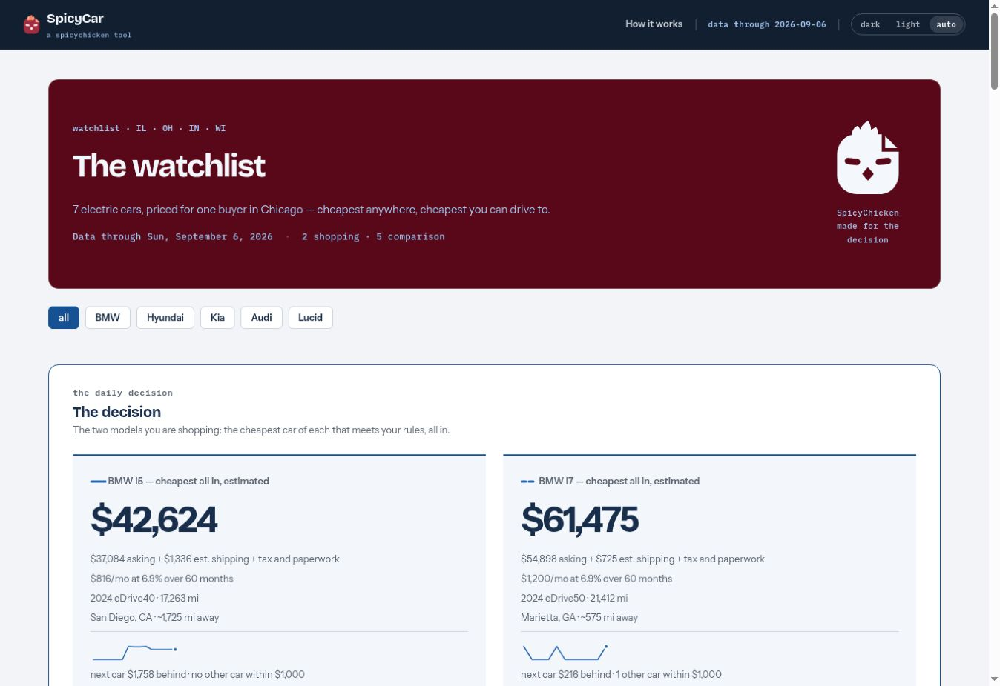
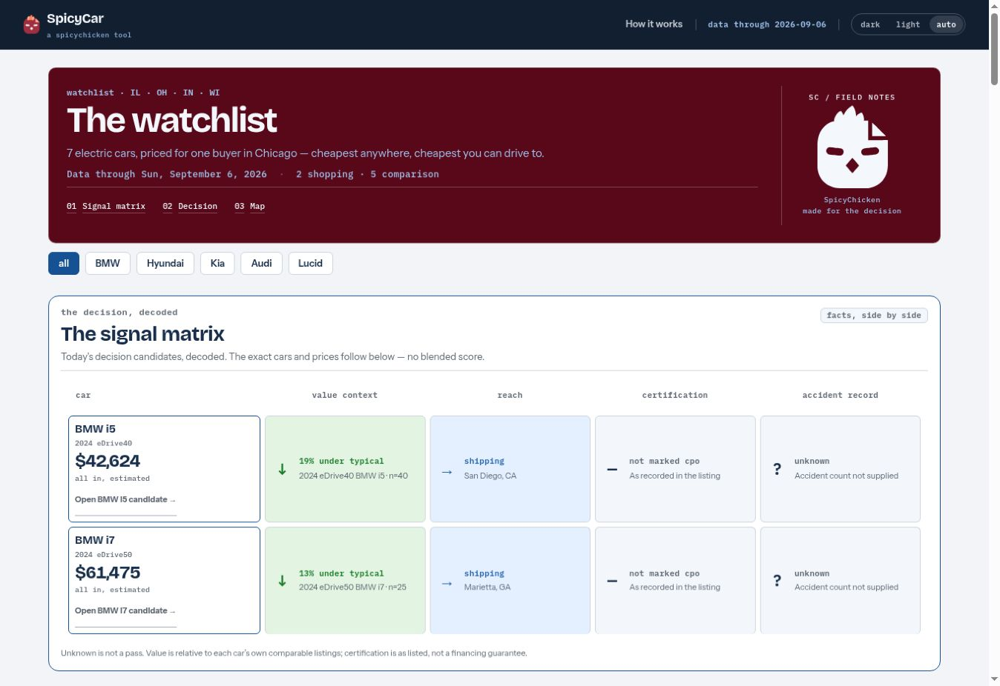
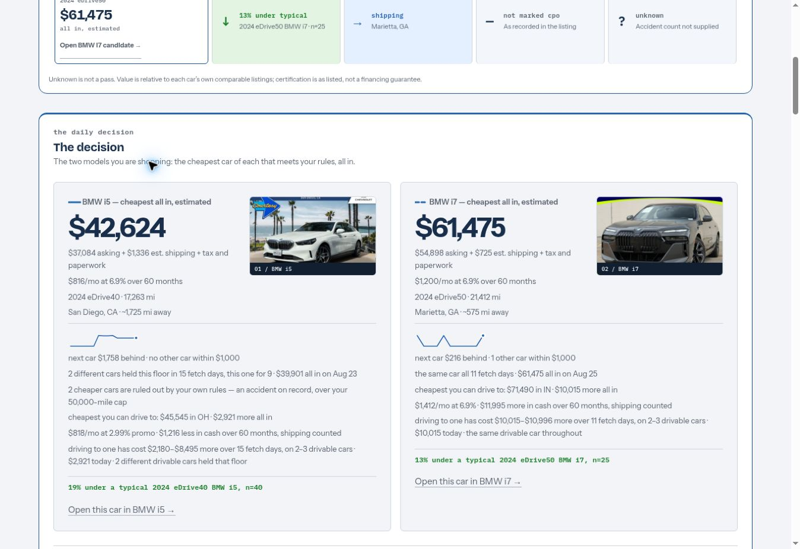
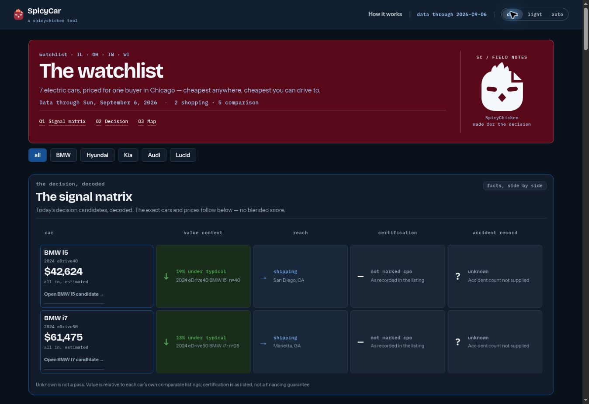
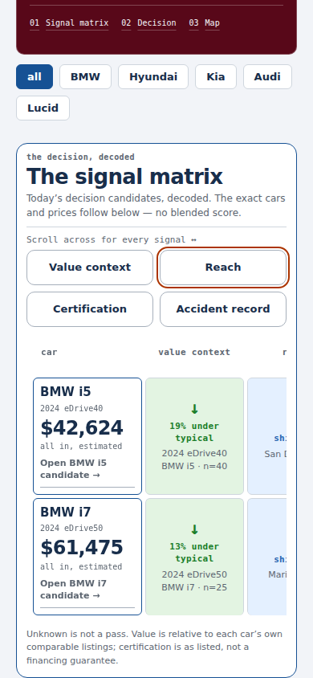
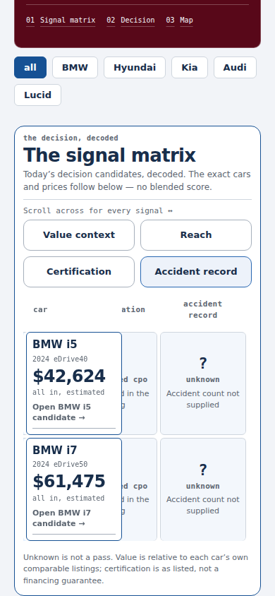

# SpicyCar design review · 6 September 2026

The desktop images below are real captures of the public SpicyCar page, not mockups. They preserve
the visual review of the matrix-first redesign in [PR #62](https://github.com/spicyChicken59/SpicyCar/pull/62).
The figures and dealer photographs are the site's snapshot on that date; they
are historical evidence, not current listing or financing claims.

| Before | After |
| --- | --- |
|  |  |

The previous homepage starts with decision details. The new opening screen
compares the same candidates across value context, reach, certification and
accident record. Exact prices stay visible; unknown evidence stays neutral.

## Decision cards



The loaded photographs belong to the exact candidate VINs. An unavailable-photo
fallback remains available; no alternate car's photograph is substituted.

## Dark theme



## Provenance and verification

- Page: <https://spicychicken59.github.io/SpicyCar/>
- Before: `6f6dba99a13d69042482bf84cf5e30535ebc969e`.
- After: `3b95d65b788cf845ea316a271a4daf16ccee917c`.
- Browser screenshot dimensions: 1348 × 926 pixels, unchanged between captures.
- Public HTML and composition stylesheet matched the reviewed Git blob hashes.
- The deployed candidate link opened the exact listing row, in view and focused.
- Both source photographs loaded; Decision and Map links reached their sections.
- PR and main checks passed: 271 browser assertions, three data-dependent skips,
  zero page errors, 342 Python tests, and consumer/snapshot validation.
- Automated layout coverage additionally included 390, 820 and 1280 pixels,
  light/dark, keyboard scrolling/focus, reduced motion, forced colors and print.

## Criterion navigation on a phone

The checked-in chart and table presentation bundle adds navigation using the
matrix's existing column headings. The application's HTML and data stay
byte-for-byte unchanged. The transposed shortlist table remains separate: its
columns name cars, so it does not receive criterion buttons.

| Criteria available without guessing | History reached directly |
| --- | --- |
|  |  |

These 390-pixel phone captures come from the Chromium regression harness using
the checked-in data and documented offline font/photo fallbacks. They verify the
new layout; the desktop captures above come from the public site. The optional
controls only appear when the native table overflows. Clicking one brings its
criterion into view while car names and prices remain visible. Swiping, keyboard
scrolling and the native table remain available without the navigation helper.

The original dashboard verification suite remains unchanged. Run the additional
design check with Playwright 1.56.1 and Chromium. The `../design-system` checkout
must be at the exact commit recorded in the snapshot provenance:

```bash
node tools/matrix_navigation_smoke.mjs ../design-system --shots /tmp/car-matrix-proof
```

Its 26 checks cover the six viewport/theme combinations, every criterion jump,
sticky identities, keyboard focus, reduced motion, forced colors, print,
rerendering and the native fallback. The exact upstream commit and asset hashes
are recorded in [`../design-system/provenance.json`](../design-system/provenance.json).
