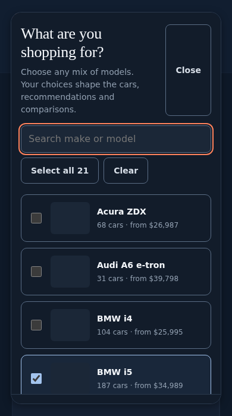
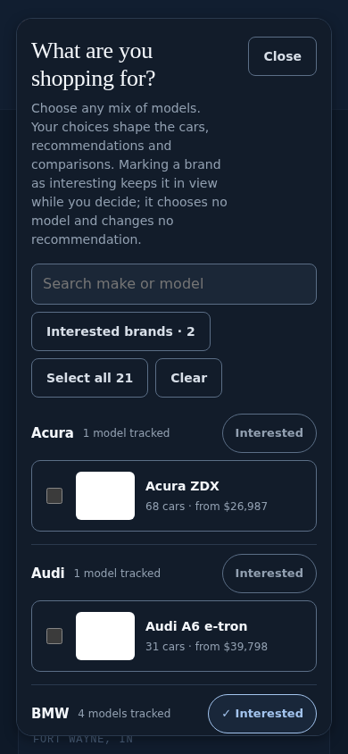
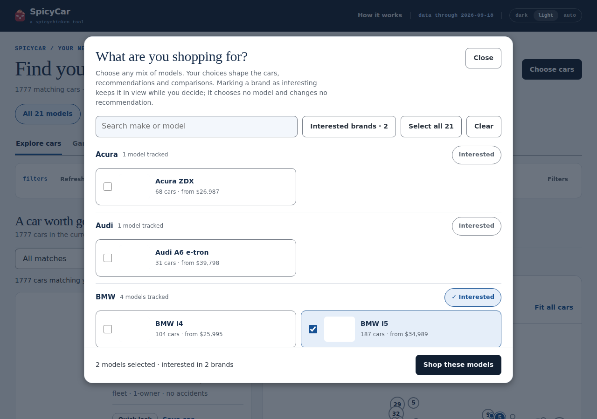
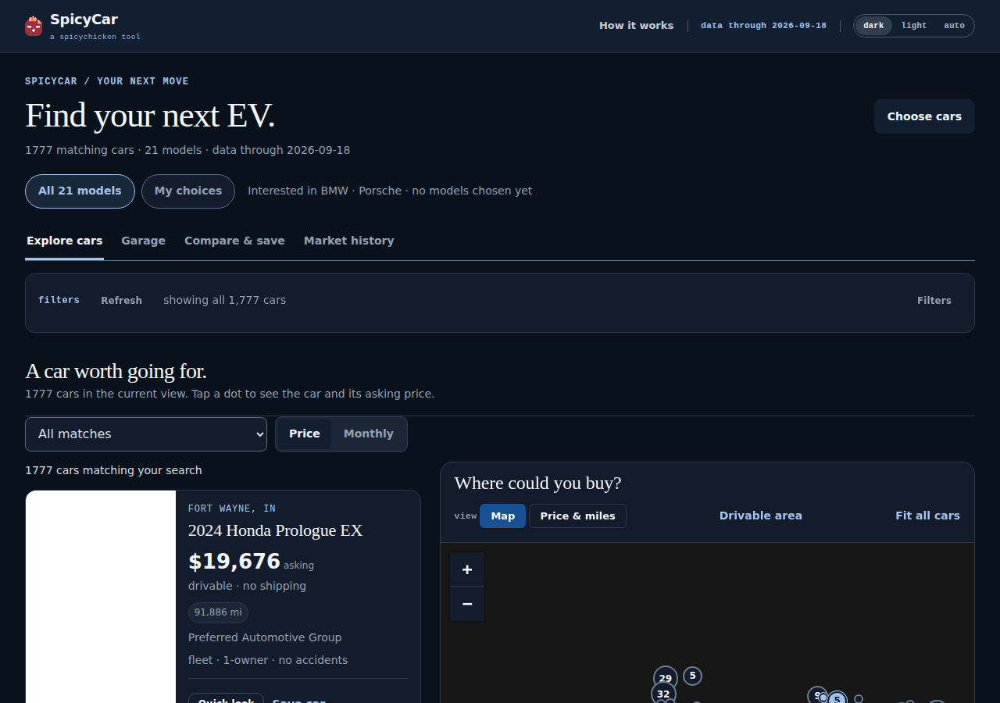

# Brands in consideration, before choosing models · 19 September 2026

One state, made where it was missing: a brand the reader wants to keep in view while they are
not yet ready to name its models. No new recommendation model, no new configuration, no ranking
arithmetic touched, no scope button that could turn curiosity into eligibility.

**Verified starting SHA** `12c3d46a6101b26220ea8aa927643a1045aae04e` (remote `main`, `snapshot
2026-09-18`; the last code merge is #82 at `3c408c78`, and the three snapshot commits since it
never ran `check.yml`). **Snapshot measured** `docs/data.json`, `data_through` 2026-09-18: 18
brands, 21 models, 1,777 live listings; BMW tracks i4/i5/i7/iX and every other brand tracks one
model. Design snapshot v2.13.0 at `ad5aa0f`, 22/22 verified, not re-vendored and not drifted.
Branch `claude/brand-interest-chooser-g83vwh`, cut from that tip with no open pull request.

## What was there, and what was not

`docs/shopping-workspace.js` drew one flat, searchable list of 21 model checkboxes, and its
only action shopped the selected models — disabled at zero. `docs/index.html` owned the shopping
set (`shoppingModels`, `S.models`, `shoppingSet()`) and had no persistent brand signal at all.
And `shoppingSet()` returns `S.models` whenever it is non-empty, while `browseModels()` writes
`S.models`: the obvious shortcut — "browse the interesting brand's models" — would have made every
model of that brand a *recommendation* the moment the reader was merely curious about it. #82's
contract, that a pick is only ever a model the reader chose, had to survive this feature untouched.

## The two concepts, exactly

**Brand interest** — `S.brandInterest`, a Set of the record's own brand keys, saved as
`interestedBrands` in the same `spicycar.prefs` profile as the model choices. Loaded through one
door, `brandInterestOf()`: only a string that names an own property of `S.site.brands` survives,
in the record's own order, so `constructor`, `__proto__`, an unknown key, a number, a duplicate
and a non-array all fall away. Read by exactly two things: the chooser and the workspace's one
summary line. Not by `shoppingSet()`, not by the picks, not by the browse scope, not by the URL.

**Shopping set** — unchanged from #82: the explicit model choices when this browser has made
any, otherwise the record's `buyer.shopping` defaults.

**The apply rule**, `docs/shopping-workspace.js`, one press, three cases:

| what the reader changed in the dialog | what the press does |
| --- | --- |
| the brand marks, not the model draft | saves the interest alone — the shopping set, the browse scope and the inherited/explicit distinction are left exactly as they were |
| the model draft (with or without marks) | saves any interest change, then shops the draft as drawn: a cleared draft is applied as an explicit empty set, never refilled from the record's defaults |
| nothing | shops the models the button names, as it always has (an empty draft with no change does nothing) |

The first draft of that rule shopped only a *changed* draft, and the existing "whole journey
with nothing pre-saved" step caught it: a reader who clears and re-checks exactly the two
default models expects *Shop these models* to browse them, and it stopped doing so. The rule
above keeps the button's promise and still never converts an inherited default into an explicit
list on an interest-only save.

## The chooser

The models are grouped by brand — `api.models()` carries `brand`, the record's key, so no display
string is ever split to find one — under a head that names the brand, says how many models it
tracks (*4 models tracked*, *1 model tracked*: a fact about coverage, never a verdict that one
fits) and carries one toggle button, *Interested* (`aria-pressed`, accessible name *Interested in
BMW*). Marked brands lead the list, then every other brand, each run in the record's own order,
fixed when the dialog opens from what was saved, so a group never moves under the pointer that
just marked it. An *Interested brands · N* control narrows the list to the marked brands and is
a view of the draft, never a choice; the search matches a brand label as well as a model label.
The primary action reads *Shop these models*, or *Save with no models* when the draft is empty —
zero models is a state the reader can keep. Escape, Close and a backdrop press discard both
drafts, and the focus returns to *Choose cars*. The workspace adds one line beside the scope
buttons: *Interested in BMW · Porsche*, with *· no models chosen yet* when the shopping set is
empty; it is hidden when nothing is marked.

| Before (390px) | After (390px) |
| --- | --- |
|  |  |

## The acceptance journey, as the harnesses walk it

Seven steps in the CI-wired `tools/browse_smoke.mjs`, on subjects chosen by **shape** from the
record — the brand tracking the most models and a brand tracking exactly one with at least twelve
cars (BMW and Porsche on this snapshot; the names are for the log) — with the planted bargain of
#82 reused as the strongest car outside the explicit model set.

- **A.** A legacy profile (every key an older build wrote, none of the new one) marks two brands
  and applies: the interest is written by key in the record's order, `shoppingModels` stays
  `null`, the subtitle and the pick cards (VIN, role and percentage) are byte-equal before and
  after, the planted bargain stays market context; a reload the context was seeded through only
  once keeps all of it, and the reopened chooser leads with the two brands, both pressed.
- **B.** Brands marked, *Clear*, *Save with no models*: `shoppingModels` is `[]`, the heading is
  not *Spicy picks*, no card is a recommendation, the decision card asks for models, *My choices*
  is disabled, the whole market still browses, and a reload keeps the brands and chooses nothing.
- **C.** From the leading groups the reader checks two BMW models and the one Porsche model:
  three explicit choices, brands still marked, *My choices · 3* pressed, the model comparison
  open on *3 models under the current filters* with no overall winner.
- **D.** With cars saved and a note written, one car taken out of the comparison, a reload: every
  save, the note, the membership and the interest survive; unmarking the brand changes none of
  them and the garage still reopens its cars.
- **E.** A tracked model with no records reads *0 cars · awaiting listings*; chosen beside a model
  with cars, every card is the model with cars and nothing is substituted; a mileage filter and
  the empty-page *Reset search filters* keep both the model choices and the interest; removing
  the interest keeps the choices; choosing only the empty model gives *0 matching cars · 1 model*,
  no card, no relaxed filter and no other model chosen for the reader.
- **F.** A profile naming `__proto__`, `constructor`, `prototype`, an unknown brand, `42`, `null`,
  an object and one real brand twice marks that brand once and leaves the object prototype
  untouched; a string where the list should be, and a profile that is not JSON, mark nothing and
  are overwritten cleanly; storage switched off marks for the visit and crashes nothing; search
  finds a group by brand name and by model name; Tab reaches the leading brand's control and
  Space toggles it; Escape writes nothing and returns the focus; Back after a shop keeps the
  interest.
- **G.** The market brand marked, its model not chosen: every pick is the chosen model, the
  bargain stays context, *My choices · 1*.

`tools/workspace_smoke.mjs` holds the structure on the committed record: one group per brand,
every group listing every model its brand tracks with the right count, keyboard marking, the
interested-only filter narrowing and widening, cancel, and an interest-only apply that leaves
`shoppingModels` and the subtitle untouched. Its one moved assertion: after *Clear* the primary
action used to be asserted disabled; it is now asserted enabled and reading *Save with no
models*, because that is the contract this milestone adds.

**Negative control** — the smallest plausible mistake, the apply handler treating a mark as a
choice (`api.shop([...draft, ...children of the marked brands])`):

> FAIL · *marking brands as interesting changes no model choice…* — the shopping models were not written: the inherited default stays inherited
> FAIL · *a brand-only decision keeps the brands…* — the cleared set is written as an explicit empty set
> FAIL · *from the brand groups the reader chooses models…* — the three models are the explicit choice
> FAIL · *curiosity about a brand does not promote its bargain into the picks* — and no model was chosen for it

Four of the five brand steps red (the fifth unmarks a brand and cannot see the mutant). Restored
from the commit and the restore proved by blob hash, `987185e2…`, with zero mutant markers.

## Three defects the harnesses found in the first draft

The *Interested brands* filter was enabled only by a full redraw, so a brand marked moments ago
could not be narrowed to until the dialog was reopened (`workspace_smoke` timed out on it);
every mark repaints the filter now, and under an active filter an unmarked brand leaves the list
with the focus handed on rather than dropped. The dialog's bottom bar overflowed its box by 5–18
px at 320px once the status line grew (*Save with no models* widest); it wraps under 380px now,
measured at 282/282. And the too-strict apply rule above, caught by an existing step.

## Verification

Executed on this sandbox (Python 3.11.15, Node 22.22.2, Playwright 1.56.1 with the pre-installed
Chromium 141) against a read-only extract of the design system at the pinned `ad5aa0f`. CI runs
Python 3.12 and Node 24. The baseline column was measured on a pristine detached worktree of
`12c3d46` before any edit; the after column on the final tree of this branch.

| # | Command | Baseline `12c3d46` | This branch |
| --- | --- | --- | --- |
| 1 | `AUTODEV_API_KEY=test-key-not-used python -m unittest discover -s tests -t . -v` | PASS · 570 run, 569 passed, 1 skipped | PASS · 570 run, 569 passed, 1 skipped |
| 2 | config and outputs are valid JSON; call plan | PASS · 29 targets, today 21, worst 21/40, 640/month (64%) | PASS · identical (no config or data change) |
| 3 | `node tools/design_snapshot.mjs` | PASS · 22/22 from `ad5aa0f` | PASS · 22/22, no drift |
| 4 | `node tools/consumer_lint_ci.mjs "$DS" docs/index.html docs/how.html tools/og_card.html` | PASS · policy clean | PASS · policy clean, no new candidate |
| 5 | `node tools/studio_smoke.mjs` | PASS · 0 page errors | PASS · 0 page errors |
| 6 | `node tools/workspace_smoke.mjs` | PASS | PASS · with the new checks |
| 7 | `node tools/discovery_smoke.mjs` | PASS | PASS |
| 8 | `node tools/browse_smoke.mjs --shots …` | PASS · 44/44 steps | PASS · **51/51** steps, 0 skips, 0 page errors |
| 9 | `node tools/fieldwork_smoke.mjs "$DS"` | PASS · 26/26 | PASS · 26/26 |
| 10 | `node tools/matrix_navigation_smoke.mjs "$DS"` | PASS · 26/26 | PASS · 26/26 |
| 11 | `node tools/dashboard_smoke.mjs "$DS" --shots …` | **FAIL · 307/309**, 14 skipped, 0 page errors | **FAIL · 307/309**, 14 skipped, 0 page errors — the same two rows |

**The pre-existing failure, kept apart.** Both dashboard rows are in *the floor delta names its
cause*: a served sheet retires the Acura ZDX's $26,987 floor car and the tile prints
*"▲ $901 vs Sep 13 — "* with no cause where *"the $26,987 car left the market"* is expected. It
fails identically on pristine `main` and on this branch, in code this branch does not touch, and
CI has not seen it because the three snapshot commits since #82 ran no workflow. It is reported
here rather than fixed, so this pull request neither inherits the green of run 35036645562 nor
disguises the red: the branch's own contribution to the dashboard tally is zero.

**Transfer budget, rechecked at `gzipSync(level: 9)`.** `docs/data.json` 406,721 bytes against
409,600, untouched by this branch (2,879 bytes of headroom, exactly the audit's figure);
`docs/index.html` 158,559 against 204,800, up 474 bytes from 158,085. No budget was raised.

**Browser evidence, inspected.** Six sessions at 1280×900, 390×844 and 320×700, dark and
light, each walked through marking two brands, an interest-only apply and a brand-only apply:
no sideways scroll of the page or the dialog in any of the eighteen readings, every *Interested*
control inside the dialog's box, 44px targets at the phone widths (40px at 1280, where the pill
is a pointer target). The four captures above were looked at, not only measured: the compact
Close (the head is top-aligned now, because the longer intro used to stretch it), the counts,
the pressed pill, the disabled *My choices*, the summary line.

### Evidence classes, kept apart

- **Committed snapshot observations** — the 18/21/1,777 figures and the BMW/Porsche subjects,
  read from `docs/data.json` at `12c3d46`.
- **Deterministic fixture evidence** — the seven browse steps and the negative control, on
  shaped copies of the record served to one browser context each; the dealer photographs are the
  offline 1×1 stand-in and the map geometry a synthetic atlas.
- **Newly executed local tests** — the table above.
- **GitHub CI** — none yet for this branch when this was written; the pull request's run is the
  authority on Python 3.12 / Node 24, and the dashboard job is expected red on the two
  pre-existing rows until they are addressed on their own.
- **Live/provider facts** — **NOT RUN.** No provider call, no tracker fetch, no `daily.yml`
  dispatch, no mail, no deployment, no merge.

## Keep / fix / defer / omit

**Keep.** One `brandInterestOf()` door for brand keys. One summary line, no dashboard. The
three-case apply rule, and the negative control that pins the case that matters. Marked brands
leading the chooser in the record's order. Zero models as a state the reader can keep.

**Fix if it bites.** The intro sentence is eight lines at 390px; the list is a scroll below it.
The desktop pill is 40px tall where the phone's is 44px.

**Defer.** The consumer linter reads only stylesheet links without a query string, so the four
stamped product stylesheets — `shopping-workspace.css` among them — are not linted in CI (they
never were). This branch's rules were run through the linter's own `analyse()` by hand: no
squat, no unknown class, no raw colour; the promotion-candidate count in that unlinted file is
29, from 22. Whether to stamp-proof the linter, and how to adjudicate 29 candidates at once, is a
separate pass. The two dashboard rows above are the snapshot's own and are deferred to their
owner. The 320px page overflow noted in earlier passes is unchanged.

**Omit.** A browse-by-brand scope button (it would write `S.models` and promote the brand's
models to recommendations — the one shortcut this milestone exists to refuse), a two-model
quota, an automatic representative or "best fit" per brand, brand interest inferred from
choices, saves, price, scores or visits, any change to `Tracking.py`, `targets.json`, the
record, the workflows, the shared design system or a sibling repository. None was touched.
