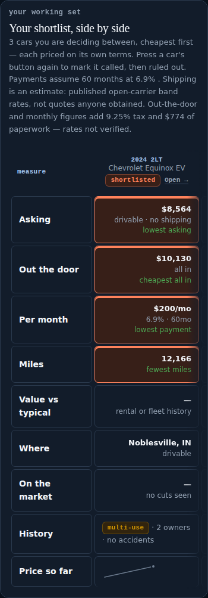
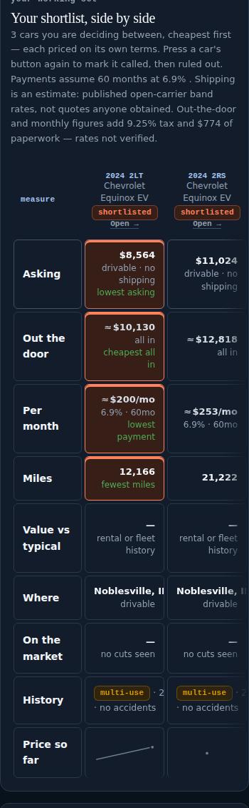
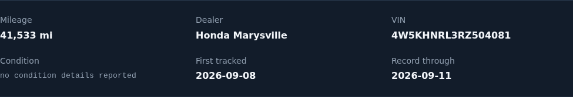
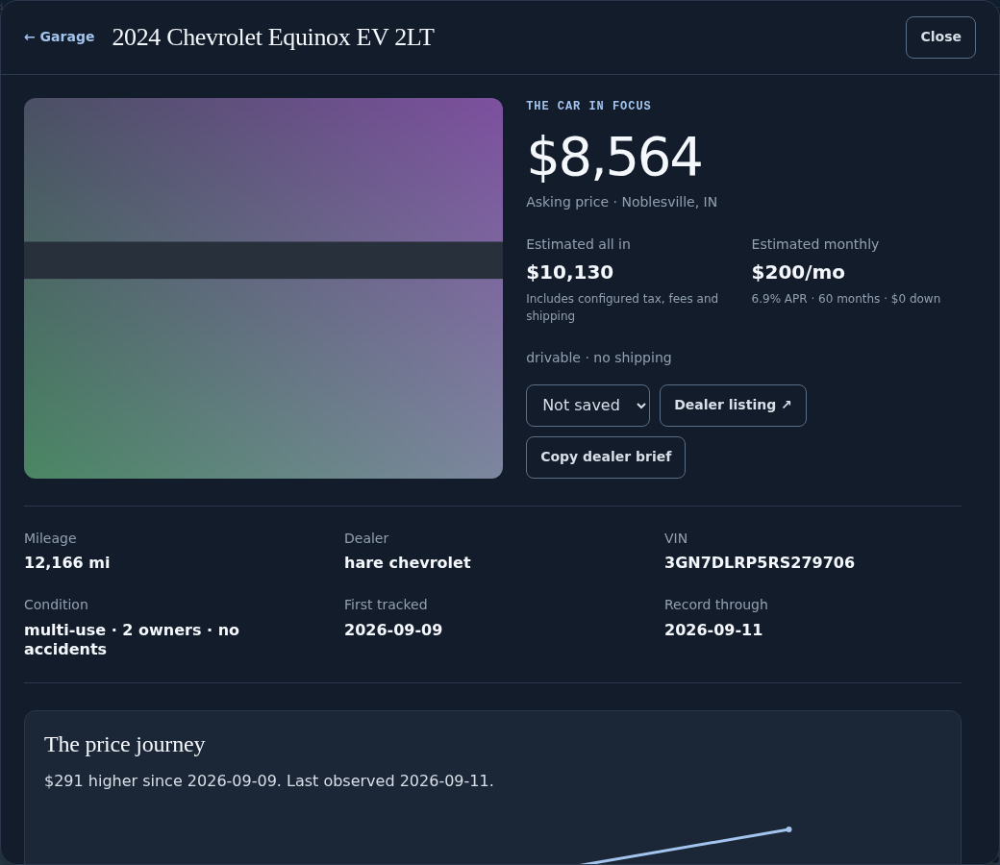
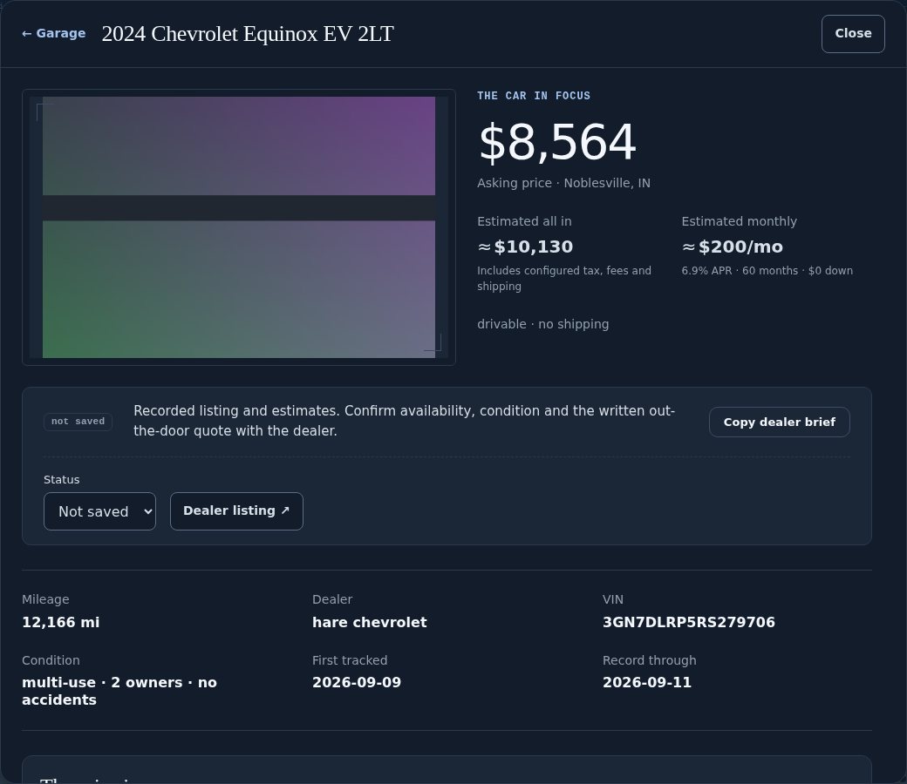

# Decision polish · 13 September 2026

One bounded pass over the shopping journey — choose a model, inspect an exact
vehicle, compare evidence and costs, save or open the source — rendered in
Chromium before anything was edited, records and saved cars held constant. Three
weaknesses, measured rather than argued.

## 1 · "Side by side" showed one car on a phone

`#finalists-table` kept `.sc-signal-matrix`'s 680px floor: three saved cars were a
**693px table in a 348px region** — columns 136/176/176/185, the measure column
and **one** car on screen, **373px off it**. The narrow band that would have saved
it was written for `#compare-table` alone.

It is upstream now as **`.sc-signal-matrix--fit`**, for the transposed shape the
criterion navigator excludes by design; both tables wear it and the local fork is
gone. After: **96/112/112/112**, the measure column and **two** cars on screen,
132px off. Identity stays sticky, nothing is hidden, desktop is unchanged.

| Before | After |
| --- | --- |
|  |  |

## 2 · A recorded price and two computed ones wore one ink

Asking, out-the-door and per-month were one ink in the dossier and one size,
weight and colour in the shortlist; in the signal matrix the **largest number on
the card** was the estimated all-in, its basis in a 10px note. An unreported fact
wore a measured fact's 16px heading ink.

Upstream: **`.sc-estimate`** and **`.sc-unreported`**. Recorded is the default and
wears no class. A derived figure steps one shade off heading ink and takes the
approximation mark — drawn in CSS with empty alt text, so the word beside it
still carries the meaning. An absence becomes a mono lowercase status word at its
own size, never lining up with a number. No figure changed.

## 3 · The photograph had no shape of its own

The hero stretched to whatever height the fact column needed, cropping the same
photo **1.26:1 at 1280 and 1.60:1 at 390**, and three actions wrapped into two
ragged rows (129/153/166px) with the primary one last. The stage is
`.sc-dossier--studio` now — 16:10 at both widths, contained, cornered, with the
shared no-photo band — and the dialog ends in one `.sc-actionbar`.

| Before | After |
| --- | --- |
|  |  |

## Provenance and verification

Before: `0a427ca9e8d1a37a38251d1b4c77beae2512a57d` at design-system `08cd626f`
(v2.10.0). Captures come from the Chromium harness over the checked-in
`docs/data.json` with the documented offline font and photo fallbacks: evidence
of layout, not of a listing or a financing claim.

**Upstream, integrated.** `design/car-decision-polish` (`6068da8`) went in through
design-system #24; SpicyHome's parallel branch reconciled it into its own before
both landed on `main` as `600283f` (#23). Additive both ways, checked:
`6068da8` is an ancestor of `main`; the sheet diff from it is Home's `.sc-pick`
and nothing else; the one edit to mine is Home renumbering my section `4f → 4g`,
still **last in the component band** — the load-bearing property its own comment
names. The snapshot is re-vendored from that merged `main`, 22 files, every hash
verified. Upstream `npm run check` is green there (110
component blocks, 368 classes) but for the missing v2.12.0 tag, the owner's to
publish: a tag cannot be pushed from this sandbox.

**PASS** (offline): consumer lint · `studio` · `workspace` · `discovery` ·
`visual-check --browser` 6/6 · print pagination on both tables · 320px · keyboard
reach · reduced motion · forced colors · the missing-photograph state.
**FAIL, pre-existing:** 2 Python tests of 565; 4 dashboard checks of 306 — each
reproduced on an `origin/main` worktree, "what failed" identical.
**CI** at `0ddf11e`: lint green, the same six, `302/306, 16 skipped, 0 page
errors`. Attempt 1 died mid-run on `route.fetch: read ECONNRESET`; the re-run
matched this sandbox exactly, so the transport error was transient — the crash
was not. A throwing async route handler is an unhandled rejection outside any
step's `try`: node ends the process and 300 decided checks report nothing.
**NOT RUN:** provider calls, a tracker run, Pages.

## Keep / fix / defer / omit

**Keep:** `--fit` on both comparison tables; basis marks applied from what the
record says, never from a computation; the photo stage and the one action bar.
**Fix if it bites:** the action bar is 293px tall on a phone (98px as a ragged
row) — the height buys a bounded, ordered block, but the listing link is now
below a sentence; the no-photo band is a 144px slab in a 480px stage.
**Defer:** `dashboard_smoke.mjs` has 34 unguarded `await route.fetch()` calls in
its route handlers — the same defect its own header records fixing for locators
one layer in, reproduced here in isolation as exit 1 with the tally lost. Giving
them the error boundary the steps already have would have turned that run into
four named failures instead of none. Also: the discovery card's four-action
footer (Home owns list composition), and `--sc-matrix-record` as a `calc()` over
the region rather than a tuned pixel. **Omit:** any change to the tracker,
watchlist, `targets.json`, ledgers, ranking or financing arithmetic. Nothing here
touches a number.

## Next builder prompt

> Continue SpicyCar. The upstream integration for this pass is **done**; what
> follows is not design work.
>
> State: design-system `main` is `600283f` (v2.12.0 in every version string,
> carrying both this pass's `.sc-estimate` / `.sc-unreported` /
> `.sc-signal-matrix--fit` and SpicyHome's `.sc-pick`). SpicyCar branch
> `claude/spicycar-shopping-polish-0ebw1k` (PR #77) pins that exact commit,
> re-vendored from the clean merged checkout, all 22 hashes verified. SpicyCar
> PR #67 (`design/print-table-flow`) is superseded — its two print rules are
> byte-identical in this snapshot and its pin is four releases older — but it is
> still OPEN and must not be closed or merged without approval.
>
> Three things remain, none of them this branch's to fix:
> 1. **No `v2.12.0` tag exists.** `npm run check` on design-system `main` fails
>    on exactly that, and every documented jsDelivr pin (`design-system@v2.12.0/…`)
>    is a 404 until it is published. A tag cannot be pushed from this sandbox:
>    the agent proxy passes `refs/heads/*` and refuses `refs/tags/*`. Cutting a
>    release in the GitHub web UI targeting `main` is the way round it, and it is
>    the owner's call, not yours.
> 2. **SpicyCar CI is red on tracker drift, not on this diff.** `test` fails two
>    tests (the committed record's key order; the README `| as committed |` sheet
>    row) and `dashboard` fails four (price sort order, the BMW i4 stock sentence,
>    "Open this car", and `docs/data.json` at 282KB compressed against a 250KB
>    budget). All six reproduce on `main` at `0a427ca` — diff the smoke's "what
>    failed" block against an `origin/main` worktree before believing otherwise —
>    and every fix means regenerating published tracker output. `main` has taken
>    three daily snapshot commits since its last green run, and the commit-back
>    does not trigger the workflow, so no run reported on them until #77's.
>    Whoever next runs the tracker owns these. If a `dashboard` run instead dies
>    with `route.fetch: read ECONNRESET` and prints no tally at all, that is the
>    harness's own unguarded route handlers, not your diff — see Defer above.
> 3. **#77 wants a human merge.** It is conflict-free with no review threads.
>
> If you do pick up the tracker work: `Tracking.py`, `targets.json`,
> `docs/data.json`, `REPORT.md` and the ledgers are its territory and were
> deliberately untouched here. Re-run, in this order, with the linter's checkout
> matching the pin:
> `AUTODEV_API_KEY=test-key-not-used python -m unittest discover -s tests -t . -v`,
> `node tools/design_snapshot.mjs`,
> `node tools/consumer_lint_ci.mjs <design-system@600283f> docs/index.html docs/how.html tools/og_card.html`,
> `node tools/studio_smoke.mjs`, `node tools/workspace_smoke.mjs`,
> `node tools/discovery_smoke.mjs`,
> `node tools/dashboard_smoke.mjs <design-system@600283f> --shots /tmp/car-review`,
> then look at the shots at 390 and 1280 in both themes.
>
> Do not weaken a lint rule or mask an overflow. A basis mark is applied from
> what the record already says about a figure, never from a computation the page
> just performed.
