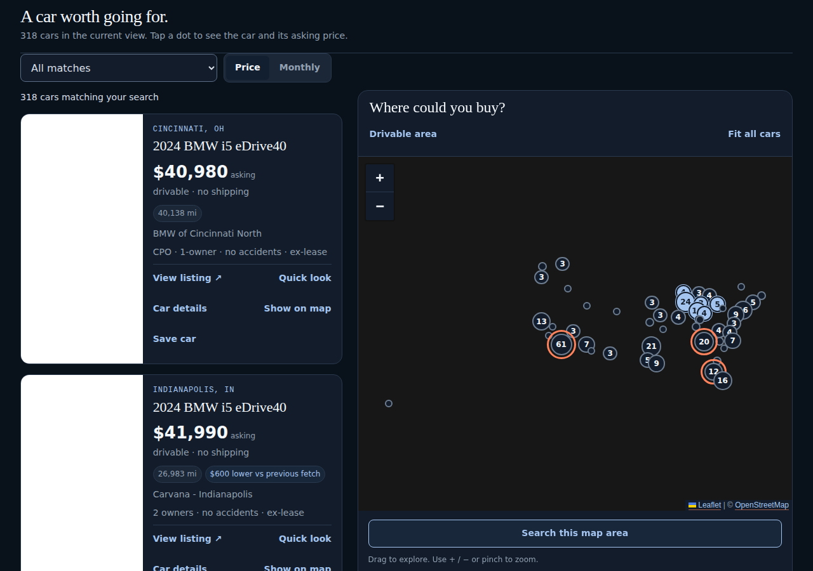
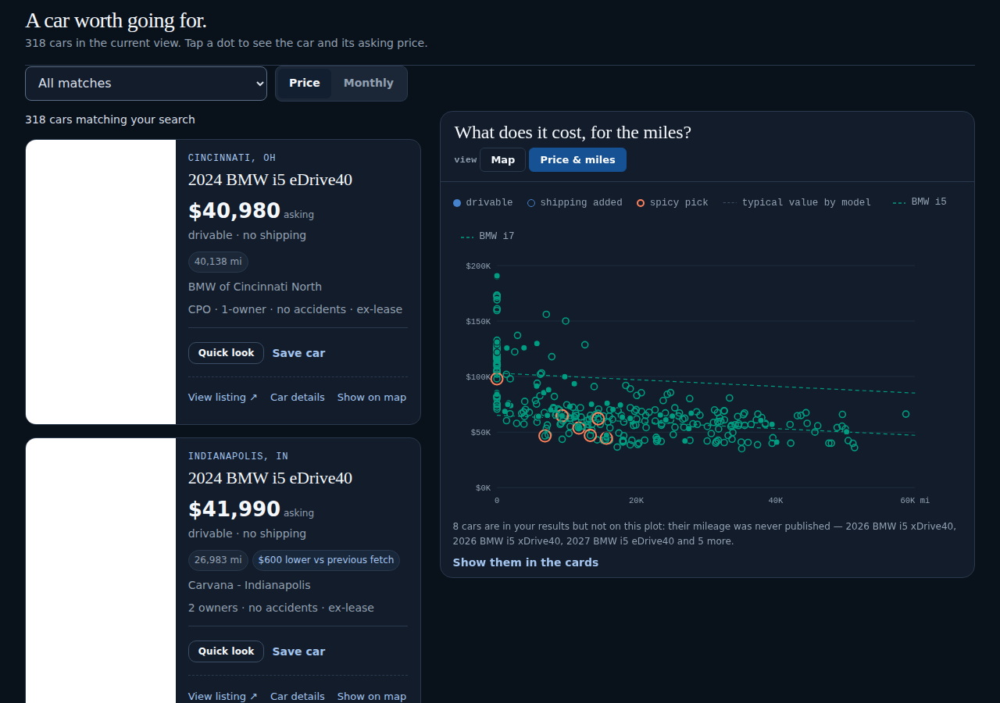
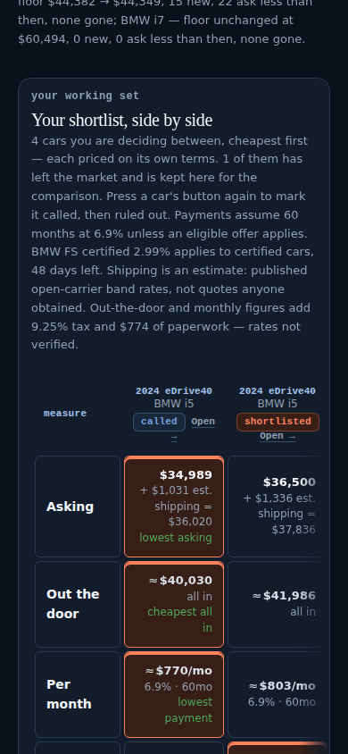
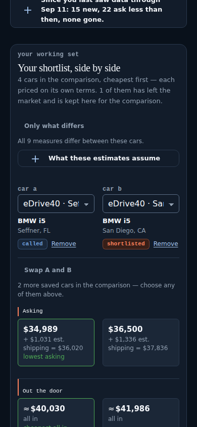
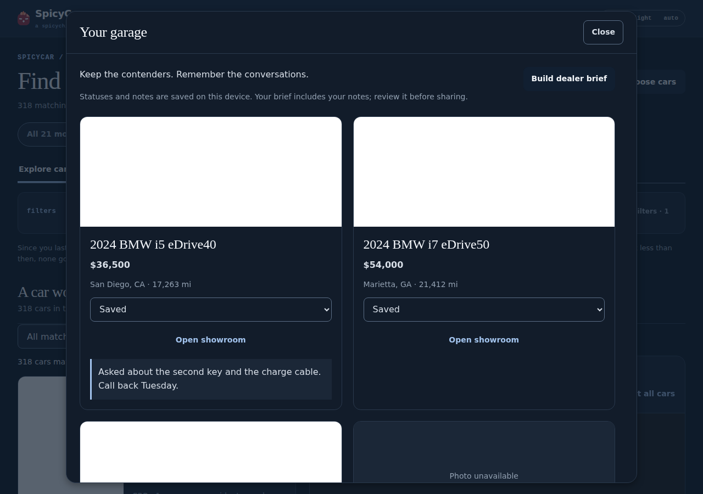
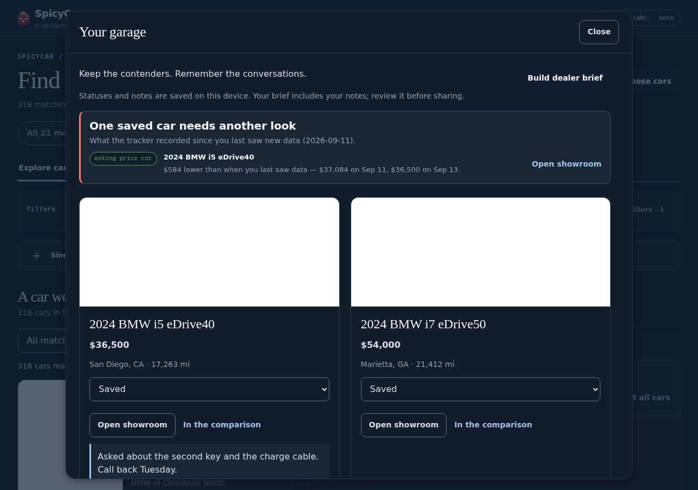

# Discover → Compare → Decide · 13 September 2026

One pass over the whole shopping journey — choose models, browse, inspect a VIN,
compare actual cars, save one, come back — rendered in Chromium over the
committed `docs/data.json` and a fixed saved-car state before anything was
edited. Three weaknesses, each measured rather than argued, and the connected
answer to them. Nothing here touches the tracker, the watchlist, `targets.json`,
the ledgers, the ranking or the financing arithmetic: no number on the page
changed, only which cars you can see and what the page says about them.

## 1 · Three views of the same cars, and only two of them were connected

`Explore` already held the cards and the map as one browse surface over one
filtered candidate set. The price-against-miles scatter was a **different
section on a different view** (`Market history`), scoped to one model page, and
on the watchlist — where the reader actually shops — it did not exist at all.
So the one plot that answers "where does this car sit among the ones I am
looking at" could not be asked about the cars in front of you.

The panel beside the cards reads the same visible candidates two ways now. The
segmented control is the design system's captioned `.sc-field--group` at desktop
width; on a phone the existing Cars / Map switch takes a third button. The plot
is the dashboard's own `renderScatter()`, scoped rather than copied — one dot
rule, one tooltip, one keyboard contract, one definition of a spicy pick — with
per-model typical-value lines where a cross-model median would have been a
fiction, and a caption that says so when there are too many models to draw them.

Every view now owns its own omissions out loud. The map has 17 cars with no
verified location and the plot 8 with no published mileage; both are counted in
the panel's own sentence, named, and reachable in one press — *Show them in the
cards* — rather than silently short of the count above them. A missing mileage is
never a zero on the plot: the car is not plotted, and it is said.

| Before | After |
| --- | --- |
|  |  |

Choosing a car is one selection across all three: a card, a marker or a dot marks
the other two and rides in the address bar as `?car=`, with `?show=` for the
view, so a reload and a shared link both land on the same car in the same view. A
chosen car the filters exclude is **never** quietly let back in — the page names
the filter or the unshopped model hiding it and offers the one press that changes
it, which stays the reader's own act.

## 2 · The phone comparison was 220px of table off the edge

`--fit` (v2.12.0) got the measure column and two car columns onto a phone. With
four saved cars the table is still **568px wide in a 348px region — 220px off
screen** — and above it sat 250px of assumptions: eleven lines of financing and
cost-basis prose before the first car.

Upstream as **`.sc-compare-pair`** (v2.13.0), because SpicyStock had improvised
the same answer in its own stylesheet: two records named in a head that stays put
while the measures scroll, one measure per row, both values beside each other in
equal columns. Which two is the reader's — a chooser per side, so the third car
is a selection and not a truncation. After: **two named cars on screen, nothing
off it**, and the hint 250px → 62px with the assumptions one press away under
*What these estimates assume*. Every figure still carries its own basis where it
is read: `.sc-estimate` on a derived number, `.sc-unreported` on one the source
never supplied, and the word beside it either way.

| Before | After |
| --- | --- |
|  |  |

Two more things the comparison now separates. **Membership is not saving:**
*Remove* takes a car out of the table and leaves it saved, with its notes and its
status, and one press puts it back — the garage says the same thing from its own
side. And **rows the cars agree on are marked as such** (`data-differs`, also
upstream): *Only what differs* prints the rest and keeps the folded ones readable
under the table, never dropping identity, cost basis or uncertainty.

The record behind a price is in the decision now rather than only in the dossier:
*18 observations, Aug 23–Sep 13 · $2,000 lower*, with the days the tracker
actually looked — never a daily price it never took — and one press to the dated
list the showroom already draws.

## 3 · The garage remembered everything except what had changed

Saved cars, statuses, notes and dealer briefs were all there; what the record had
**done** since the reader last saw data was on the front page, about models, and
nowhere about their own cars. The garage leads with that now: the cars the record
moved under, each with the observation date behind it and one press to the
showroom. The baseline is `spicycar.seen` — the data day the reader last saw,
which only advances when the DATA does — so a reload is not a new observation, a
newer site build is not a fresh one, and a listing that stopped being seen is
never called a sale. A car that has not moved says the quieter thing on its own
card ("still listed at $36,500, seen again Sep 13") and stays out of the band.

| Before | After |
| --- | --- |
|  |  |

## Also measured, and smaller

- **The discovery card's action footer**, the trade-off the last review deferred.
  Five presses of equal weight in a wrapping row, 141px over three ragged rows at
  1280px. Now one next action (*Quick look* — the showroom holds the photograph,
  the costs, the price journey, the note and the brief), *Save car* beside it,
  and the three other ways of looking at the same car quiet under a rule: 108px,
  and the card 395px → 366px. **Nothing was removed**; every action the card had,
  it has. On a phone the row is 93px → 116px, which buys a 44px target for every
  press — the primary was a 28px desktop button under a thumb.
- **The first car on a phone** sat at 804px of an 844px screen. The title block is
  one line instead of two, the data day is not repeated under a masthead that
  already says it, and the since-your-visit sentence leads with totals and keeps
  the per-model lines behind them: **804px → 726px**, with the view switch and the
  count on screen above it.
- **The photograph** keeps a landscape frame when it sits above the body (16:9 in
  the stacked bands) instead of stretching to whatever the text column needs, and
  the missing-photo state is the shared typographic treatment — mono, lowercase,
  on the raised ground — rather than a grey sentence.

## Provenance and verification

Before: SpicyCar `694c90a` (the merge of #77) at design-system `600283f`
(v2.12.0). Captures come from the Chromium harness over the checked-in
`docs/data.json` with the documented offline font and photo fallbacks — evidence
of layout, not of a listing or a financing claim. The photo areas in these
captures are the harness's 1×1 stand-in, not the design.

**Upstream.** `.sc-compare-pair` and `data-differs` are design-system v2.13.0
(`ad5aa0f`), committed and vendored from a clean checkout: 22 files, every
SHA-256 verified by `tools/design_snapshot.mjs`, `npm run check` green on all
eighteen gates there and `build/compare-pair-check.mjs` pressing the claims in
Chromium at 390 and 1280 in both themes. The local fork is gone — SpicyCar keeps
only what is about cars. **The design-system release is a separate pull request
and this page's snapshot already carries its commit**: the two land together or
this branch is pinned to an unmerged commit.

**PASS** (offline): 565 Python tests with the same 8 pre-existing failures as
`main` · design snapshot 22/22 · consumer lint clean on all three pages ·
`studio` · `workspace` · `discovery` · `browse` 21/21 · `dashboard` **301/309,
the identical 8 failures `origin/main` alone gives, 0 page errors** · 320, 390,
820 and 1280px in both themes.
**FAIL, pre-existing and unchanged:** the same 2 Python drifts and 8 dashboard
checks the last review recorded — the committed record's key order, the README
sheet row, the price sort, the BMW i4 stock sentence, "Open this car", the four
owed by `the decision, day by day`, and `docs/data.json` at 301KB compressed
against its 250KB budget. Every one of them reproduces on `main` alone and every
one is the tracker's, not this diff's; `index.html` is 151KB compressed against
its own 200KB budget, inside it before and after.
**NOT RUN:** provider calls, a tracker run, Resend, Pages.

## Keep / fix / defer / omit

**Keep:** one visible-candidate set read three ways; omissions named and
reachable in the view that cannot draw them; the selection in the address bar;
comparison membership separate from saving; the record's own change detection as
the garage's baseline.
**Fix if it bites:** the plot draws 310 dots in a 620×340 panel on a busy night
and the y-axis starts at $0 because the shared `ticks()` rounds down to its step
— honest, and dense; the A/B choosers truncate a long trim at 390px (the model
and city under each carry the identity); the first car on a phone is still below
the fold at 726px.
**Defer:** the <320px page overflow, pre-existing and identical on `main`; the
eight dashboard failures and two Python failures, which are the tracker's to fix
by regenerating published output.
**Omit:** any change to the tracker, watchlist, `targets.json`, ledgers, ranking
or financing arithmetic. Nothing here touches a number.
