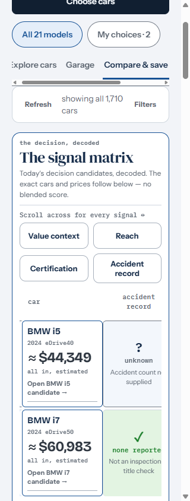
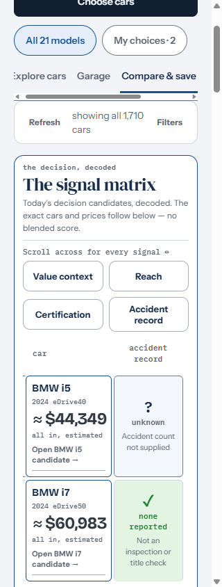
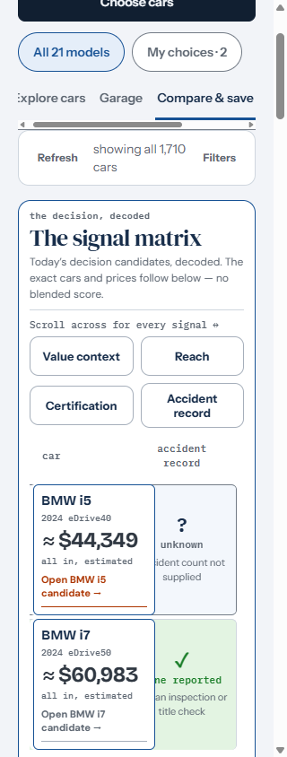
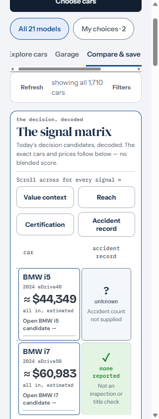
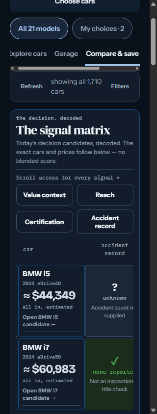
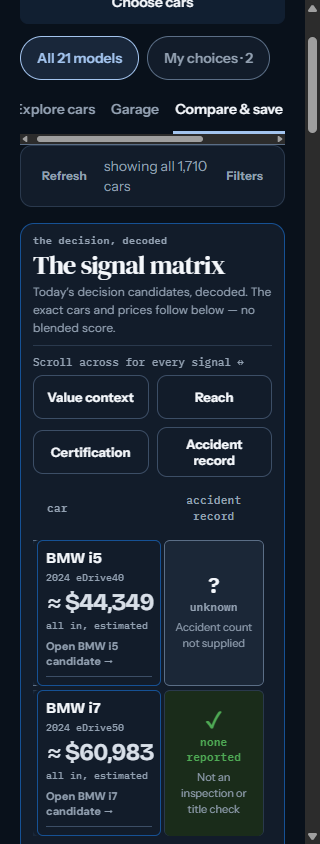
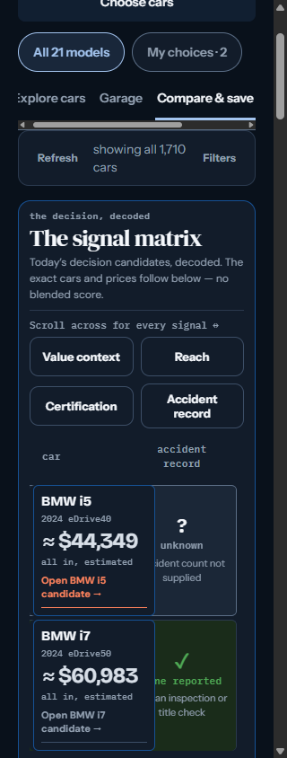
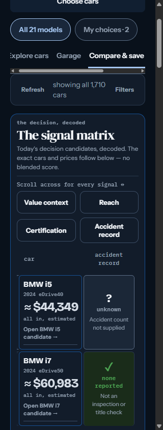
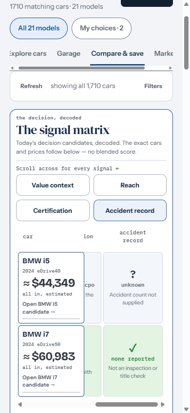
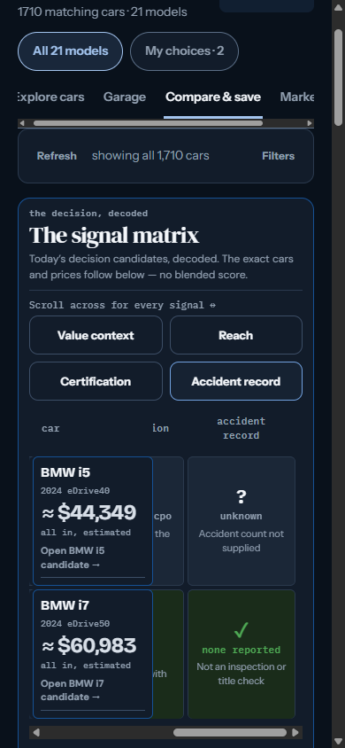

# Signal-matrix qualification visibility

Isolated local Chromium captures of the committed September 19 snapshot.
These are not live dealer verification or changes to Tahir's preferences.
External vehicle/map requests were blocked; the app and recorded data came
from the checkout. Webfonts loaded normally. Ordinary scrollbar gutters were
enabled, matching the live review's 239px scrollport at a 320px viewport.

Base: `96eb90d6ea4363c79b26caa7c574cce84e44ad42`.
Arrival: `/` → **Compare & save** → **Accident record**, yielding
`/?view=compare`; reload, both themes, 320×844. Default BMW i5/i7 choices,
All 21 models, unchanged filters. The actual matrix rows are:

- BMW i5 `WBY33FK06RCR58557`: **Unknown — Accident count not supplied**.
- BMW i7 `WBY43EJ02RCS67624`: **None reported — Not an inspection or title check**.

Before: scrollport x=33–272, sticky identity x=37–173, and a -4px left gutter
shadow (no rightward extension). The 650px fixed-layout table gives each
criterion 122.5px. At the jump (scrollLeft 388), the i7 qualification's first
line is x=183.19–284.31: 12.31px outside the scrollport. At maximum scroll
(419), it is x=152.19–253.31: 20.81px under the fixed identity. The TD also has
overflow:hidden; its DOM presence is not evidence of readable text.

The screen-only correction at ≤360px uses a 550px table and 124px identity,
allowing one complete wrapping criterion beside identity, including gutters.
It changes no text, typography size, semantics, candidates or shared assets.

| State | Before | After |
|---|---|---|
| 320 light, criterion jump |  |  |
| 320 light, maximum right |  |  |
| 320 dark, criterion jump |  |  |
| 320 dark, maximum right |  |  |
| 390 light |  |  |
| 390 dark |  |  |

All captures above were inspected. The 390, 820 and 1280px before/after
criterion-jump captures are byte-identical in both themes.

The existing CI-wired `matrix_navigation_smoke.mjs` preserves its original 26
checks and adds 48: rendered text ranges, each clipping ancestor, the painted
identity boundary, and glyph hit tests (including the start/end of words).
It checks all four visible criterion controls, reload, 320→390→320 resize,
keyboard activation, maximum-right wheel scrolling, and exact row/evidence
continuity. A separately labeled DOM-only long-qualification fixture stresses
wrapping; it is discarded by ordinary navigation and never changes source data.

With unmodified baseline CSS: **FAIL**, 48/74 checks passed, 26 failed,
zero skipped. All original 26 checks passed. With the correction: **PASS**,
74/74 passed, zero skipped. The unchanged workflow uploads final-head
`matrix-text-*.png` and `matrix-text-measurements.json` with its existing
`dashboard-screenshots` artifact. See the PR for final-head CI results.

Local Windows harness runs used an uncommitted adapter for installed Chrome,
the bundled Playwright package, and Windows path separators. The CI runner
executes the authored harness directly with its existing Playwright version.
