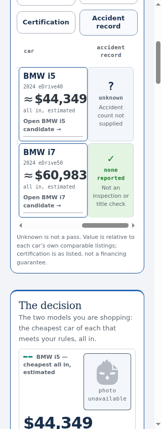
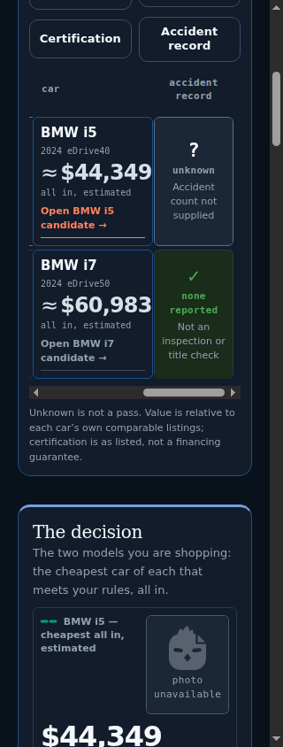

# PR #87 integration with lossless current main

This is fresh local evidence from the integrated checkout below, using the actual
September 21 `spicycar-sheet` version 1 transport. The September 19 evidence in
`../matrix-qualification/` remains unchanged and is historical, not this proof.

## Exact state and scope

- Starting PR #87 head: `ba0a251e22baec0b4e9a00df3aa6a50e1d8e0e68`.
- Original branch base: `96eb90d6ea4363c79b26caa7c574cce84e44ad42`.
- Integrated main: `4c7d375f965fa0edf1c4886b8db5f49213deab0d`, the squash merge of #88.
- Actual local tested checkout: `e6a150f8dadd6eb19bc05543cc72b475256de4fa`.
- Actual local tested tree: `66cf93458bdfe5a8655b3cd3957bc97f39f38909`.
- That history-preserving merge has parents `ba0a251e22baec0b4e9a00df3aa6a50e1d8e0e68`
  and `4c7d375f965fa0edf1c4886b8db5f49213deab0d`. No conflicts or code corrections.
- The following commit adds only this evidence directory. The PR description
  records its final SHA and the final CI checkout, parents, tree, run and artifact.

Main advanced from the original base through the September 20 and 21 snapshots
and #88. All were reviewed and preserved. #87 and #88 have no changed-file
intersection. The application delta against integrated main remains the accepted
14 lines in `docs/market-studio.css`: screen-only <=360px, 520px table minimum,
wrapping headers, unchanged 136px identity and type sizes. The 74-check matrix
harness and original evidence are byte-for-byte unchanged from the starting PR.
All 146 existing main files outside #87's changed paths retain their Git blobs.
See [integration-provenance.json](integration-provenance.json).

The previously running exact-main check **35687555378 is PASS**, with all three
jobs and all required steps completed successfully. This is baseline evidence;
the PR description separately identifies the final integration CI.

## Deterministic local validation

| Check | Executed result | Declared | Passed | Failed | Skipped / NOT RUN |
|---|---|---:|---:|---:|---:|
| Python | PASS | 604 | 603 | 0 | 1 |
| Dashboard | PASS | 337 | 323 | 0 | 14 |
| Matrix navigation | PASS | 74 | 74 | 0 | 0 |
| Photo dossier/fieldwork | PASS | 26 | 26 | 0 | 0 |
| Browse shopping journey | PASS | 63 | 63 | 0 | 0 |

Skips are **NOT RUN**, never passes. Python's existing reason is
`no national_only target configured`. The exact 14 dashboard subjects and reasons
are in [test-accounting.json](test-accounting.json) and [dashboard.log](dashboard.log).
No declaration, backstop, assertion or subject selection was changed.

Studio, workspace, discovery, JSON validation, call plan and pinned-design
consumer lint: **PASS**. Studio/workspace/discovery do not declare numerical
check counters; each completed with zero errors and no skips. All browser suites
ran sequentially, using fresh contexts and recorded local data; see
[browser-execution.json](browser-execution.json). The matrix suite ran separately
before that sequence. Logs retain the actual commands and results.

Tools: Python 3.12.14, Node v24.19.0 for browser/lint suites, Playwright 1.56.1,
Chromium 141.0.7390.37. Capacity accounting separately used Node **v24.11.1**.
The shared design checkout was read-only at v2.13.0 /
`ad5aa0f82af7aa98def5807ae33b01bdb0a1e868`.

## Application and matrix evidence

The unchanged server in `matrix_navigation_smoke.mjs` serves the checkout's
`docs/data.json` and decoder directly. Wire SHA-256:
`05b3228df2e43cd46d9b1061e9555a114cf1576fa8d3bd787daf6319b04533bf`.
No old plain-JSON fixture replaced the application snapshot.

All original 26 checks plus 48 qualification checks executed: **PASS**. The fresh
[measurement artifact](matrix-shots/matrix-text-measurements.json) contains **40
measurements** (30 actual-snapshot, 10 separately labeled long-text fixture),
**1,122 text range fragments**, **zero failures**, and zero horizontal-position
changes caused by measurement. It covers all four criterion controls, clipping
ancestors, sticky-column occlusion, actual text ranges, glyph hit tests, reload,
320 -> 390 -> 320 resize, keyboard/focus, exact VIN/evidence continuity,
reduced motion, forced colors, print and native fallback.

Actual rows remain BMW i5 `WBY33FK06RCR58557` ($44,349 estimated all-in) and BMW i7
`WBY43EJ02RCS67624` ($60,983). At 320px, accident jump and maximum scroll both use
scrollLeft 289. The readable range is x=173-272; the i7 qualification's widest
line is x=183.296875-254.6875, clear of both boundaries.

The 14 committed matrix screenshots were individually inspected. Their filenames,
hashes and findings are recorded in [matrix-inspection.json](matrix-inspection.json).
The 320px jump/end captures in both themes, keyboard resize-return captures,
390px captures, long-text fixtures and 820/1280px regressions show no new defect.
The 820px matrix retains its existing horizontal scrolling and criterion controls;
1280px displays the full matrix without unnecessary controls.

| 320px light, accident jump | 320px dark, maximum right |
|---|---|
|  |  |

The separate capacity acceptance harness: **PASS**, two completed isolated contexts
(1280x900 dark and 320x844 light), zero page errors. All eight committed capacity
screenshots were inspected. [browser-acceptance.json](capacity-browser/browser-acceptance.json)
records exact VIN, source URL, first/last observation dates, every displayed price,
note and comparison membership across reload. Explicit model choices and saved
state remain unchanged when independent brand interest is marked. Actual unknown
mileage remains null and visibly unreported; missing history remains reachable
and is not presented as a sale. The phone missing-history capture is scrolled
within that long list; the desktop capture includes the explanatory heading.

## Fixed snapshot preservation and capacity

[capacity-proof.json](capacity-proof.json): **PASS**, complete type-sensitive Python
equality over **201,736 values/containers** and JavaScript deep strict equality,
including **1,701 live listings and 3,024 missing/history records**. Current main's
logical snapshot is still September 21; no newer observation was replaced.
The original plain input was extracted into a temporary path from
`c6510d077be197139a5ee88e365e1a9632ba4a87:docs/data.json`.

Node v24.11.1 `gzipSync(..., {level: 9})`; the 838-byte decoder is charged against
both unchanged limits. These are compressed-payload estimates, not HTTP captures.

| Payload | Actual bytes including decoder | Limit | Headroom | Result |
|---|---:|---:|---:|---|
| Data | 375,772 | 409,600 | 33,828 | PASS |
| Page | 160,808 | 204,800 | 43,992 | PASS |
| Synthetic +5% | 393,675 | 409,600 | 15,925 | PASS |
| Synthetic +10% | 408,428 | 409,600 | 1,172 | PASS |
| Synthetic +20% | 441,273 | 409,600 | -31,673 | FAIL |

Differences from the recorded Node v24.11.1 proof: **zero bytes in every case**.
The +20% capacity failure is the expected bounded stress result, not an integration
failure. These fixtures are not forecasts or proof of unlimited retention.

Full tests retain malformed/unsupported/truncated transport rejection, no partial
decoded result, previous-complete-data retention after a bad refresh, recovery,
and atomic-write failure contracts. The corrected Lucid tests preserve history,
target identity, aggregate mapping, exclusion of out-of-scope historical cars
from current inventory, and publication of later eligible observations under
reactivated trim IDs. The stale percentage assumption was not restored.

Reproduce the fixed proof with temporary outputs:

```sh
git show c6510d077be197139a5ee88e365e1a9632ba4a87:docs/data.json > /tmp/pr87-plain.json
python tools/verify_sheet_capacity.py --baseline /tmp/pr87-plain.json --node /path/to/node-v24.11.1 --out /tmp/pr87-capacity
node tools/capacity_acceptance.mjs /tmp/pr87-browser
node tools/matrix_navigation_smoke.mjs /path/to/pinned-design-system --shots /tmp/pr87-matrix
```

## Limits and disposition

All evidence is isolated local/browser evidence. External dealer/provider requests
were blocked or answered by local stand-ins; imagery is not dealer verification.
The earlier live-profile persistence review remains **BLOCKED** and was not retried.
The long qualification and malformed transport cases are explicitly fixtures.
No provider calls, changed budgets, retention, settings, schedules, deployment
behavior, shared design, sibling repository edits or new features are included.
FACT/FIT/INTUITION, source dates, unknowns, accessibility and the distinction
between recommendations and market context remain intact.

**KEEP:** accepted matrix CSS/harness and #88 transport, decoder, tests and data.
**FIX NOW:** none; no integration defect found.
**DEFER:** independent guidance review, plus the previously blocked live-profile review.
**OMIT:** geographic-caption, Honda external-link, dense-plot and copy changes,
future capacity architecture, replacement PRs and a merge into main.

Return the updated existing PR #87 for independent review of its exact final head
and CI tree. This builder pass does not merge it.
