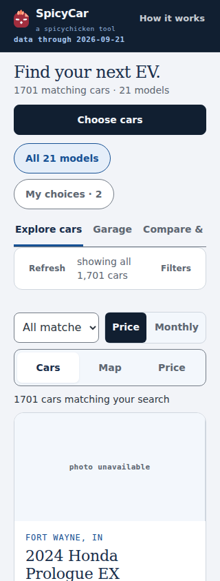
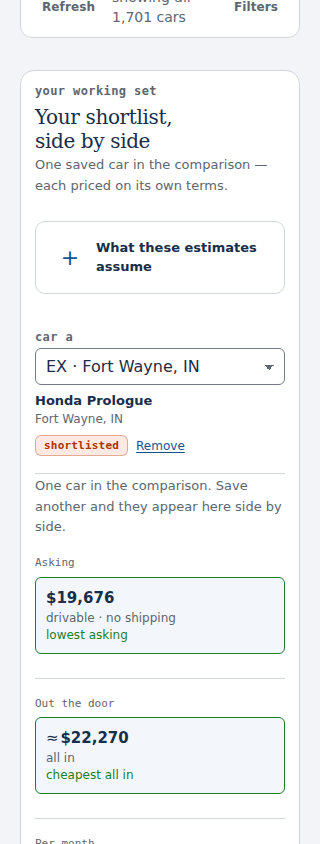
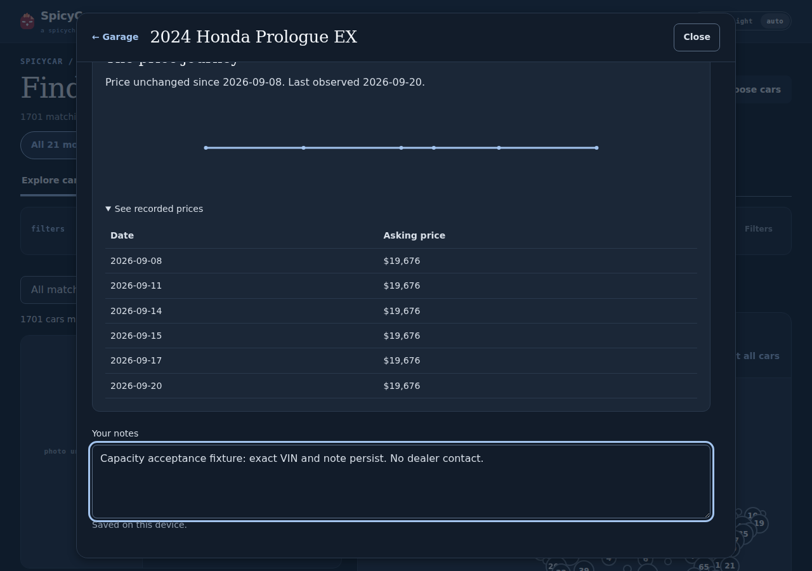
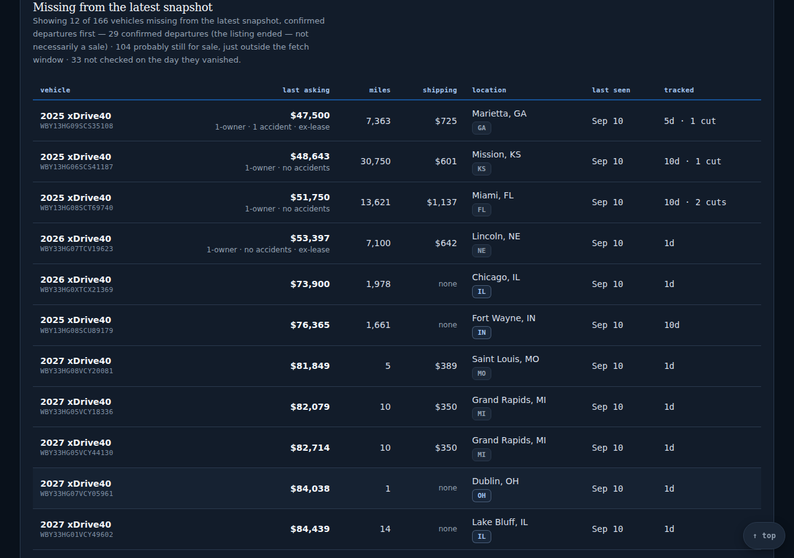

# Lossless snapshot capacity correction

Base: `c6510d077be197139a5ee88e365e1a9632ba4a87` (September 21 snapshot).
Separate branch: `fix/lossless-snapshot-capacity`. PR #87 is not incorporated or modified.
The original data blob is `2d2457b186c04e97571f308ce5b41b66acf2b987`.

## Representation and preservation

`spicycar-sheet` version 1 interns distinct object field lists, using `[0, ...items]`
for arrays and `[1, schemaIndex, ...values]` for objects. Scalars keep their JSON
types. Every container is tagged, so no field name, string or user array collides
with a transport marker. The encoder sorts object keys deterministically. The
decoded logical schema is unchanged. Python and JavaScript share this documented
contract; the browser and all repository data consumers decode before use.

The original plain sheet and the new representation compare equal over **201,736
values/containers**, including **all 1,701 live listings and 3,024 missing/history
records**. Python checks types recursively, keys, values, every array index and
negative zero; JavaScript uses `assert.deepStrictEqual`. The existing byte-for-byte
same-date rebuild test is retained, and a new test compares the decoded sheet to
the complete rebuilt logical object on **2026-09-21**. No source or provider calls
are involved. See [capacity-proof.json](capacity-proof.json).

[source-preservation.json](source-preservation.json) checks base/current Git blobs
for every input under `data/`, configuration, REPORT, collector, workflows,
matrix harness and shared design assets. All are unchanged. Design remains
v2.13.0 / `ad5aa0f82af7aa98def5807ae33b01bdb0a1e868`. No retention, eligibility,
ranking, finance, source evidence, saved-state schema or provider-budget change.

The existing writer still validates before touching its temporary file, flushes,
fsyncs, atomically replaces, and removes temporary output on failure. Tests cover
invalid/nonfinite input, partial writes, fsync and replace failures. All three
existing publication paths still call that writer. Other JSON writers are unchanged.

Plain snapshots remain supported. Unknown transport versions, malformed schemas,
bad tags, bad references, truncated records and late corruption throw before any
decoded record is returned. Browser regressions verify visible failure, no partial
cards, missing-decoder failure, retention of the previous complete record on a
bad refresh, and recovery on a valid refresh. These are explicitly **fixtures**.

## Exact payload accounting

Node **v24.11.1**, `gzipSync(buffer, { level: 9 })`; compressed-payload estimates,
not captured HTTP transfers. No shards. The 838-byte compressed decoder is charged
against **both** existing limits, although the browser downloads it once.

| Payload | Raw bytes | gzip bytes | Including decoder | Limit | Headroom |
|---|---:|---:|---:|---:|---:|
| Original data | 3,536,984 | 419,208 | 419,208 | 409,600 | −9,608 |
| Version 1 data | 2,170,948 | 374,934 | 375,772 | 409,600 | 33,828 |
| Page | 494,339 | 159,970 | 160,808 | 204,800 | 43,992 |

The actual combined page, data and decoder estimate is **535,742 bytes**.
The original page is 159,929 gzip bytes. The data guard and page guard are not raised.

| Bounded synthetic case | Live | Missing/history | Data + decoder | Headroom |
|---|---:|---:|---:|---:|
| +5% per model, rounded up | 1,796 | 3,187 | 393,675 | 15,925 |
| +10% per model, rounded up | 1,882 | 3,338 | 408,428 | 1,172 |
| +20% per model, rounded up | 2,049 | 3,639 | 441,273 | −31,673 |

Growth clones are distributed across all models, with distinct hash-derived VINs
and source-link suffixes. Dates and history lengths stay fixed. These are synthetic
record-count tests, not additional observations, collection-day forecasts or proof
that an entire future retention window will fit. The 20% case deliberately records
the unchanged limit being exceeded.

Reproduce with the original plain JSON extracted from the base:

```
python tools/verify_sheet_capacity.py --baseline /path/to/original-data.json --node /path/to/node-v24.11.1 --out /tmp/capacity
node tools/capacity_acceptance.mjs /tmp/capacity-browser
```

## Inspected isolated browser evidence

Fresh Chromium contexts, **1280×900 dark and 320×844 light**, actual committed data
and unchanged as-of date. No saved profile was injected. All saved-state writes
were made through the page's controls; reload seeded nothing. External images,
fonts and maps were intercepted locally, so unavailable imagery is not dealer
verification. No live-provider evidence is claimed.

[browser-acceptance.json](browser-acceptance.json) records the exact values:

- Explore → details → save/note → comparison → reload: VIN
  `3GPKHURM2RS537858`, first tracked September 8, last observed September 20, all
  six recorded prices $19,676. Exact source link, note and comparison membership
  survive. Every displayed history point is checked against the logical record.
- Actual unknown mileage: `4W5XHPRL4RZ507282` stays JSON null and visibly says
  **Mileage unreported**, with first tracked September 13 and record through
  September 19. This is an actual-snapshot case, not a shaped fixture.
- Missing history: BMW i5 `WBY13HG09SCS35108`, last seen September 10, remains
  reachable in model research. The page distinguishes missing records from sales.
- Marking interest in Volkswagen leaves explicit model choices, saved status and
  comparison membership unchanged. Both contexts report zero page errors.

Inspected screenshots include Explore, the exact recorded-price table and note,
comparison after reload, missing-history access and unknown mileage at both widths:

| 320px Explore | 320px comparison after reload |
|---|---|
|  |  |




## Validation and existing blocker

Original backstops are retained: **580 Python**, **327 dashboard**, **26 matrix**.
This correction adds **18 Python** and **10 dashboard** checks, for **598 / 337 / 26**.
PR #87's separate 74-check matrix suite remains on its own branch for later integration.

Local Python: **596 pass, 1 failure, 1 skip**. The failure is the unchanged
`test_the_lucid_rows_are_deliberately_left_where_they_are`: current inputs give
`0.4428904428904429`, while the existing assertion requires `> 0.5`. This reproduces
on untouched base; see [baseline-lucid.log](baseline-lucid.log). No assertion or
data was weakened to pass. The existing skip is `no national_only target configured`.

All 18 added Python tests pass. All 10 added dashboard checks pass with no skips;
see [transport-browser.log](transport-browser.log). Matrix: **26/26**, photo
dossier/fieldwork: **26/26**. Studio, workspace, discovery, and all **63 browse
steps** pass. JSON, call plan and pinned-design consumer lint pass locally.

The first local full dashboard run recorded **319 passes, 4 failures, 14 skips**
(337 declared). Its four failures were in the existing shortlist-cycle step while
other browser suites were running. That unchanged step then passed **4/4** in
isolated runs on both [untouched base](baseline-shortlist.log) and the
[capacity branch](capacity-shortlist.log). This is diagnostic evidence, not a claim
that the initial full run passed. The sequential full re-run passes **323/323
executed checks, 14 skips, zero page errors**, accounting for all 337 declared
checks; see [dashboard-final.log](dashboard-final.log). The final local Python
run is [python-final.log](python-final.log). The PR also links the workflow on its
exact head. The known Lucid failure blocks a green full
check workflow until it is resolved in separately authorized work.
